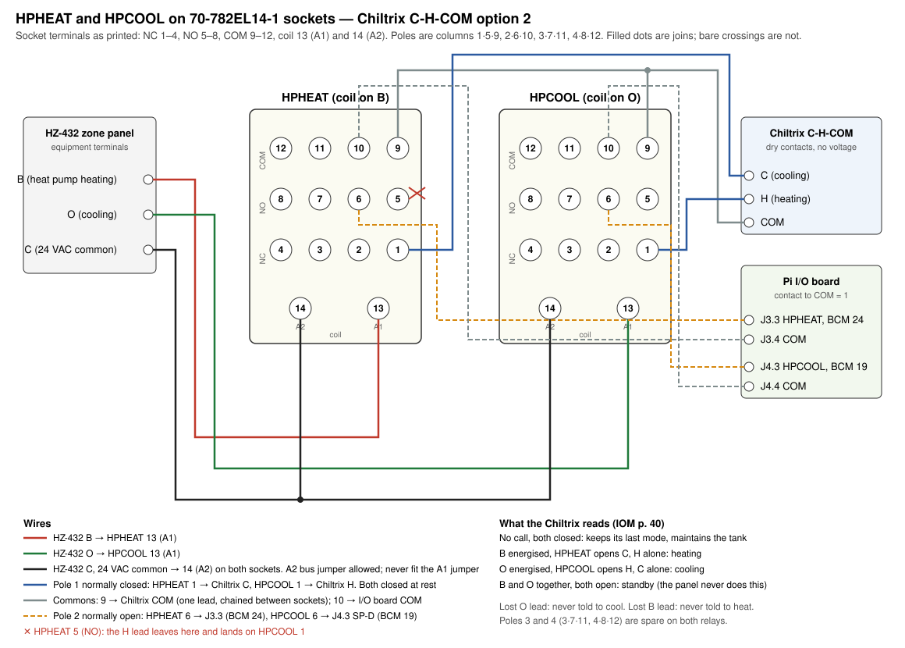

# Chiltrix shoulder-season heating — plan

**Date:** 2026-09-07.
**Status:** the HZ-432 is configured (heat pump, dual fuel, conventional thermostats) and the
`HPHEAT` relay is wired, proven in the panel's test mode and monitored on the Pi under the same
name, all on 8 September
2026, and `HPCOOL` fitted on 14 September with the `H`-`COM` pair moved to it, so the block now
runs as option 2, and the C7089U1006 outdoor sensor is fitted. Still to do: the heating target
confirmed at 50 °C and the live-call proof in §5. The controls are read from the CX65 IOM (pp. 37–41, 67) and the HZ-432 installation guide
(69-2198).
**Goal:** heat the house from the Chiltrix CX75 when outdoor air is mild, from the NTI Ti-200 boiler
when it is cold, and let the changeover happen on its own with a manual override.

## 1. What the plant already allows

Source selection on the primary is only which pump runs. Each source carries its own circulator
into the header: the boiler's UP26-99F puts the boiler in circuit, and the Taco 0015 puts the
buffer tank in circuit. In cooling the Taco runs and the primary passes through the tank; in
heating today the boiler pump runs and the primary bypasses the tank for the boiler loop. Run the
Taco with the Chiltrix in heating mode and the tank is back in circuit, so the Chiltrix heats the
house through the buffer exactly as it cools it. No valve moves and no pipe changes.

The zone side is unchanged too. The HZ-432 opens each zone's valve and starts its secondary pump
on a call of either kind, and all five zones take hot water in winter, kitchen and great room
through their M3036 hydronic modules. Loop B carries three coils in heating and wants HIGH, which
is already on the seasonal list.

Two consequences follow from the geometry. The tank is a 37 gallon thermal mass at 304 BTU/°F,
so a mode change is not instant: moving it between the 50 °F cooling target and the 122 °F heating
target is about 24,000 BTU, 25 to 45 minutes of Chiltrix output before the first heat call gets hot
water; §7 prices it. And in heating the loop-probe offsets belong to the 140 °F column in the `config.yml`
comment rather than the 45 °F values that are live, and every ΔT on the loop panel inverts sign.

## 2. The Chiltrix side

The CX75 is a reversible heat pump rated 72,000 BTU/hr and COP 4.57 at 47 °F ambient, and it has
never heated here: register 141 reads mode 0 and register 143 holds a 50 °C heating target it has
not been asked to reach. Its external-control interface is the `C`-`H`-`COM` dry-contact block on
the main board, `DIN7` for cooling and `DIN6` for heating, enabled by `P111`. The panel shows
`P111` enabled, and register 111 does not track it: it read 0 before, during and after a three-minute
disabled window on 8 September 2026 with three polls inside it, so the panel is the only reference
for this setting. With the block enabled it behaves as a single-stage heat-pump thermostat input
in one of two ways, chosen by relay type:

| Option | Relays | Behaviour |
|---|---|---|
| 1 | normally open | Closing `H` puts the unit in heating and runs it to the heating target; closing `C` does the same for cooling; both open is standby, and the tank drifts between calls. Chiltrix names this as a shoulder-season choice |
| 2 | normally closed | The unit stays in its last commanded mode and maintains the tank at target between calls, so the first call gets hot water at once |

The block has four states, drawn on IOM p. 40: both contacts open is standby, `C` alone is
cooling, `H` alone is heating, and both closed hands the mode to the wired controller. Option 2
is two normally closed relays, one per contact, each opened by the thermostat's call for the
other mode. On this plant the relays are driven by the HZ-432's `O` and `B`, which are
changeover-valve outputs: the panel holds `O` for as long as it is in cooling mode and `B` for as
long as it is in heating mode, call or no call, to spare a reversing valve the wear of cycling.
So the chiller sees `C` alone throughout cooling mode and `H` alone throughout heating mode, the
panel does the latching, and both contacts are closed only when the panel is in neither mode,
where the controller keeps its last mode. Either way the unit holds the mode of the last call and
maintains the tank on its `P12` band until the panel changes mode. This plan wires option 2. Under option 1 a satisfied heat call drops the unit
to standby and the tank coasts, which is tolerable, but a single relay driven by `B` can only ever
show the chiller one contact closed, and with `C` on its resting pole every satisfied heat call
commands cooling: the 8 September test ended with the unit back in mode 0 within a minute and 36
minutes and 1.13 kWh spent re-chilling the tank (§7). Option 2 pays the swing only when the
thermostats change their mind. A short zone call under option 2 also finds the tank already at
temperature, which matters for the kids' room and its ten-minute cycles.

Today `HPHEAT`'s normally closed pole holds `C` closed at rest and its normally open pole closes
`H` while `B` is energised, which is why `C64` reads 1 with `HPCALL` open and the compressor starts
with `HPCALL` open on 16 % of its starts. The `C` side of option 2 is therefore already wired: the
pole opens `C` on a heating call. The `H` side is what §4 adds.
Register 143 sets the heating target, whole °C. Start at 50 °C (122 °F), which is where the
unit's own `P72` caps it and the most the coils can be given, so the first heating test is
unambiguous: a zone that cannot hold at 50 °C is a balance-point problem. Step down afterward if
the zones hold with runtime to spare; each °C of water is worth about 2 to 3 % of COP, and the
coils give up about 4 % of output per °C on the way down. Heating AU mode (register 145, with `P48` capping the curve at 45 °C and `P49` an
offset) floats that target with outdoor air and is worth enabling once a fixed target has run a
few days. `P42`/`P43` auto switch-over cannot be combined with `C`-`H`-`COM` and stays off. `P08`
reads 1, DHW disabled, so a mode change carries no DHW state with it.

What the coils will deliver is the constraint that makes this shoulder-season only. Unico's
hydronic ratings assume 140 to 180 °F water, and a heating coil's output scales roughly with the
water-to-air temperature difference, so 120 °F water into a 70 °F room delivers about 70 % of the
140 °F rating and 110 °F water about 55 %. The Chiltrix's own capacity also falls with outdoor
temperature. The balance point in §3 is where those two curves cross the house's load, and it will
find itself by observation.

## 3. The decision point: HZ-432 dual fuel

The HZ-432 already contains the changeover logic, and this plan uses it rather than building one.
Configured as a heat pump system with dual-fuel operation, the panel calls the heat pump on `Y1`
with `B` energised for heating above an outdoor balance temperature, and calls the fossil
stage on `W1/E` below it. The relevant settings, from the installation guide:

| Setting | Range and default | Use here |
|---|---|---|
| System type | CONV / HEATPUMP | HEATPUMP |
| Compressor stages | 1 / 2 | 1 |
| Dual fuel operation | NO / YES | YES; requires the C7089U1006 wired outdoor sensor |
| Dual-fuel heat stages | 1 / 2 | 1, the boiler |
| Zone thermostat type, per zone | HTPUMP-O, HTPUMP-B, CONVENTIONAL | CONVENTIONAL: the Prestige IAQ zones are wired as heat/cool thermostats and the panel does the changeover |
| Dual fuel changeover | OT / OT+MULTISTG | OT+MULTISTG: by outdoor temperature, and a second-stage heat call also switches to the boiler for at least an hour |
| OT balance temperature | 0 to 50 °F, default 30 | Start at 40 °F and move it on capacity evidence; at $1.93 a therm the chiller is the cheaper source down to about 35 °F (§8) |
| Changeover delay | 15 to 180 min, default 30 | 30 |
| Auto changeover delay | 15 / 20 / 30 min | 30, the arbitration when one zone calls heat and another cool in the same hour |
| Emergency Heat | button on the panel | Forces the boiler regardless of outdoor temperature |

Winter conversion is then a number or a button: raise the balance temperature to 50 °F, or press
Emergency Heat, and the boiler carries the house. Spring is the reverse. Nothing is rewired
between seasons.

The alternative, kept for the record, is a selector relay in the CDP where `W1` leaves the panel:
de-energised it passes the call to the boiler as today, energised it passes it to a relay that
closes the Chiltrix `H` contact and runs the Taco, with the coil driven by a manual switch or a
Shelly 1 Mini that pivac commands from the RedLink outdoor temperature. It fails to the boiler and
it needs no panel reconfiguration, but the balance point, the cannot-keep-up fallback and the
override would all have to be built, and the automated version puts software on the heating path.
The panel does all three already.

## 4. Wiring

The HZ-432's `Y1` drives the `HPCALL` relay (named `CHIL` until 15 September 2026), whose poles
run the Taco, enable the calling zones' secondary pumps and feed the Pi input on BCM 25; its `W1`
drives the `BLR` relay, which carries the boiler call and the Pi input, with the zone valves locked
out while `DHW` and `W1` call together (§4.1); its `B` drives `HPHEAT`, whose
normally closed pole holds the chiller's `C`-`COM` closed and opens it while `B` is energised;
and, since 14 September 2026, its `O` drives `HPCOOL`, whose normally closed pole holds `H`-`COM`
closed and opens it while `O` is energised. The two pairs from the chiller are two pairs,
`C`-`COM` on `HPHEAT`'s pole 1 and `H`-`COM` on `HPCOOL`'s, both `COM` conductors on the block's
one `COM` terminal. The jumpers Chiltrix ships on the block are out and `P111` is enabled. The
panel holds `O` through cooling mode and `B` through heating mode (confirmed 14 September 2026:
`HPCOOL` read 1 without a break through calls and idle while `HPCALL` cycled), so one contact stays
open for as long as the panel is in a mode, and both are closed only when it is in neither.

| Signal | Source | Does |
|---|---|---|
| `Y1` | HZ-432 equipment terminal | Energises the `HPCALL` coil, as today: the Taco and the calling zones' pumps run on any heat-pump call, heating or cooling. `HPCALL` no longer touches the chiller |
| `B` | HZ-432 equipment terminal, held for as long as the panel is in heating mode (25.6 VAC on `Y1` and `O` with `B` dark on a cooling call, `B` energised in the panel's Checkout heat-stage test, 8 September 2026) | Energises `HPHEAT`; its normally closed pole opens `C`-`COM`, leaving `H` alone: heating |
| `O` | HZ-432 equipment terminal, held for as long as the panel is in cooling mode (1 without a break on `HPCOOL` through calls and idle, 14 September 2026) | Energises `HPCOOL`; its normally closed pole opens `H`-`COM`, leaving `C` alone: cooling |
| neither | The panel in neither mode, as after a power-up before any call | Both contacts closed: the controller keeps the mode it last held and maintains the tank |
| both | Only if the panel raised `B` and `O` together, which it does not | Both contacts open: standby. Harmless |
| `COM` | chiller | Return for each contact, dry, no voltage applied; each pair carries its own `COM` conductor to its relay's pole 1 common |
| `W1/E` | HZ-432 | Energises the `BLR` relay: boiler call and the Pi input. §4.1 gates it through the `DHW` relay |
| `HPHEAT` spare pole | | J3.3 on the I/O board, BCM 24, as `HPHEAT`: 1 while the panel is in heat-pump heating mode |
| `HPCOOL` spare pole | | The `SP-C` channel, J4.2 on the perfboard, BCM 13, as `HPCOOL`: 1 while the panel is in cooling mode, so all summer. On the rev A board `SP-C` ends on the J8 pads, so at the swap the wire goes to J4.3 `SP-D` and the config pin to 19 |

A lost `O` lead leaves the chiller in its last mode and never commands cooling; a lost `B` lead
never commands heating. Neither runs anything it should not. `HPHEAT` was fitted and proven
against `B` on 8 September 2026 and `HPCOOL` on 14 September, when it read 1 in Signal K against
a live cooling call with `HPCALL` 1 and `HPHEAT` 0.

Both relays are Magnecraft 782 series 4PDT ice cubes with 24 VAC coils in 70-782EL14-1 sockets.
The socket's terminals, from its datasheet (Schneider legacy general purpose relays, socket
specifications p. 62): normally closed 1 to 4, normally open 5 to 8, common 9 to 12, coil 13 (A1)
and 14 (A2), with the poles in columns 1·5·9, 2·6·10, 3·7·11 and 4·8·12. Pole 1 carries the
chiller contact and pole 2 the Pi input; poles 3 and 4 are spare. The socket's coil bus jumpers
link A1 and A2 across neighbouring sockets: the A2 side may carry the shared 24 VAC common, and
**the A1 side must not be fitted**, since the two coils are driven by different terminals.

| Socket terminal | `HPHEAT` | `HPCOOL` |
|---|---|---|
| 13 (A1, coil) | HZ-432 `B` | HZ-432 `O` |
| 14 (A2, coil) | HZ-432 `C`, 24 VAC common | HZ-432 `C`, 24 VAC common |
| 9 (pole 1 common) | `COM` conductor of the `C` pair | `COM` conductor of the `H` pair |
| 1 (pole 1 normally closed) | Chiltrix `C` | Chiltrix `H` |
| 5 (pole 1 normally open) | nothing | nothing |
| 10 (pole 2 common) | I/O board `COM` (J3.4) | I/O board `COM` (J4.4) |
| 6 (pole 2 normally open) | I/O board J3.3, `HPHEAT`, BCM 24 | I/O board J4.2, `SP-C`, `HPCOOL`, BCM 13 |
| 2 (pole 2 normally closed) | nothing | nothing |
| 3, 4, 7, 8, 11, 12 | spare | spare |



The `C`-`H`-`COM` block takes dry contacts only; the IOM warns against applying voltage to it, and
both pole 1 contacts meet that. `P112`, the on-board auto switch-over, shows disabled for both
heating and cooling on the panel and stays that way, since it cannot be combined with
`C`-`H`-`COM` control. The freed `Y2FAN` relay in the CDP is a plain 24 VAC relay and can serve as
`HPCOOL` if a second 782 is not to hand; `Y2ON` is a timer relay and cannot.

### 4.1 The DHW bridge: the tank covers a heat call the boiler refuses

As built, `W1` reaches the boiler through the `BLR` relay whatever the boiler is doing. The Ti-200
serves DHW or space heat and never both, so a `W1` that arrives during a DHW call is refused at the
boiler, and the CDP locks the zone valves out while `DHW` and `W1` call together so that no cold
water circulates through the coils in the meantime. `BLR` on the Pi reads `W1` upstream of all of
this, which is why the record holds refused calls: 38 of them in the two weeks from 30 March to
13 April 2026, 8 to 39 minutes long and most 12 to 15, through which the Sentry's circulator LED
stayed dark and its aux circulator LED, the DHW pump, stayed lit. The header is isolated from the
boiler for the whole of such a call. The gap is the DHW call itself; the Ti-200's DHW priority time
limit does not shorten it, because the boiler never accepts the space-heat call.

The change moves the gate from the zone valves to `W1`. `W1` goes to the boiler through a normally
closed pole of the `DHW` relay, so the boiler is never offered a call it will refuse. The normally
open contact of the same pole carries the refused call, `W1` AND `DHW`, to a new relay `DHWX` whose
contacts parallel `HPCALL`'s, so the Taco and the calling zones' pumps run from the tank for the
length of the DHW call. The chiller, in heat mode under option 2, reheats the tank on its own band
as the zones draw it down.

`DHWX` must be its own relay. Driving the `HPCALL` coil from the gated `W1` would tie the coil node
to two panel terminals: on a bridged call `W1` would appear on `Y1`, and on a cool call during DHW
`Y1` would appear on `W1`, where the `BLR` relay would read it as a heat call and the zone-valve
lockout would act on it. Dry contacts paralleled contact for contact have no such path.

| Terminal | Connection |
|---|---|
| `DHW` relay, a changeover pole | common `W1` from the panel; normally closed to the `BLR` relay coil and the boiler call as today; normally open to `DHWX` coil A1 |
| `DHWX`, Magnecraft 782 with 24 VAC coil in a 70-782EL14-1 socket | A2 to the panel's `C` common; the socket's A2 bus bar may be fitted, the A1 bar must not, since a neighbouring socket's A1 is `B` or `O` |
| Pole 1 | across `HPCALL`'s contact on the Taco 503 zone controller's input, so either relay starts the 0015 and the calling zones' pumps. Wired 15 September 2026 |
| Pole 2 normally open | I/O board J4.3 `SP-D`, BCM 19, published as `DHWX`: 1 while the tank is covering the boiler. Wired 15 September 2026; SwitchBank order 11 |
| Inhibit | a switch in series with `DHWX` A1, opened with the controller in §9's out-of-service procedure |

If the `DHW` relay has no free changeover pole, a second relay with its coil in parallel with
`DHW`'s supplies one. Keep the `BLR` coil upstream of the gate: `BLR` then keeps meaning `W1`, the
record keeps showing refused calls as it does now, and `DHWX` marks the bridged ones. With `W1`
blocked at the boiler the zone-valve lockout no longer protects anything against the boiler, and it
must not act during a bridged call, so it goes; what it protected against remains in one case, a
bridged call against a tank at room temperature with the controller off for the winter, and the
inhibit switch covers that. A Shelly 1 Mini in the same position, commanded by pivac from register
140, would automate it and fail to no bridge, which is harmless.

Capacity is adequate. The house needs about 50 kBTU/h of output at 20 °F, the CX75 makes 40 to 45
kBTU/h there, and the tank's 11 °F band holds 3,300 BTU, so a 30-minute call is covered on all but
the coldest nights. `HPCALL` stays de-energised on a bridged call, so the Pi sees `BLR` 1, `DHW` 1, `HPCALL` 0 and
`DHWX` 1, and `LoopDelta` gates the primary on either relay.

The relay went in on 15 September 2026. A bench test at 22:05 that evening moved the boiler call to
`DHWX` on a DHW call and started the Taco; the pulses were seconds long, so the 1-minute record
cannot show whether the zone valves opened. The first real call, below the balance point with a heat
call and a DHW call together, should show `DHWX` 1 and `ZV` 1 with `BLR` 1 and `DHW` 1, `IN`
climbing toward the tank temperature within a minute, and the chiller restarting on its band.

Where it pays: above the balance point the panel raises `Y1` and no `W1`, so the bridge is idle and
DHW blocks nothing. It engages when the panel is on the boiler with the chiller on: the second-stage
hour under `OT+MULTISTG`, the changeover delay, or a day near the balance point. Below the balance
point with the controller off it does nothing, and §9 prices keeping the chiller on for it.

## 5. Sequence

1. On the Chiltrix panel, read `C63` (the `H` contact) and `C64` (the `C` contact). Today `C64`
   is 1 and `C63` is 0 at rest and they swap while `B` is energised; after the §4 rewire both read
   1 at rest, `C64` drops to 0 on a heating call and `C63` drops to 0 on a cooling call. That
   proves the contacts register. The IOM's own preconditions for relay control (p. 40) are met or
   become so here: DHW is disabled at `P08`, `P112` auto
   switch-over is off, `P111` is enabled, and each mode's target is set from the controller
   before the relays are relied on. Use the Mode button to enter heating, confirm the heating
   target at 50 °C, return to cooling, and read register 143 back through
   `hvac.chiller.chiltrix.heatingTarget`. The IOM adds that the controller's schedule timers are
   unavailable under relay control, which changes nothing here.
2. The C7089U1006 outdoor sensor is fitted to the HZ-432 (14 September 2026). Make the two
   changes that need no panel work: Loop B to HIGH, the 140 °F loop-probe offsets swapped in.
3. `HPHEAT` is wired per §4 and proven with the HZ-432's test mode. Its spare pole is on J3.3,
   BCM 24, and publishes as `electrical.ac.switch.utility.HPHEAT` since 8 September.
4. `HPCOOL` is fitted per §4 (14 September 2026), `13: outname: HPCOOL` is in the GPIO block of
   `/etc/pivac/config.yml`, its `order` is 5 in `~/.signalk/baseDeltas.json`, and it publishes as
   `electrical.ac.switch.utility.HPCOOL`, reading 1 for as long as the panel is in cooling mode.
   Still to confirm on the panel: in cooling mode `C64` reads 1 and `C63` 0, with or without a
   call; the first heat call swaps them, `HPCOOL` drops to 0 and `HPHEAT` rises to 1, and they
   stay swapped after the call ends with register 141 holding 1.
5. Reconfigure the HZ-432 per §3 and prove the heating side of the changeover with a real
   call: with the outdoor sensor reading above the balance temperature, a zone heat call should
   put 24 VAC on `Y1` and `B` and none on `W1/E`; with Emergency Heat pressed, 24 VAC on `W1/E`
   and none on `Y1`. Checkout steps 11 to 14 show which terminals each zone thermostat raises.
6. Force one heating call on a mild evening and watch four things: register 141 goes to 1, the
   Taco runs on `HPCALL`, the boiler stays quiet on `BLR`, and `UBT` climbs toward the target with
   loop supply following it after the tank lag.
7. Leave the balance temperature at 40 °F for a fortnight and read the record: zone droop,
   second-stage calls, and the Chiltrix's runtime and COP against outdoor temperature decide
   whether it moves.

## 6. pivac and the dashboards

The Modbus feed already publishes everything the changeover shows: `operatingMode`,
`heatingTarget`, `inletTemp`, `outletTemp`, `compressorHz` and `startupFlow`, which works in
heating as it does in cooling because the pump-only plateau precedes every start. `HPHEAT` and `HPCOOL` join
the relay roster and the Relays panel. `pivac.LoopDelta` needs no change to gate, since `HPCALL`
closes on either call, but every ΔT it publishes reads negative in heating under the warm-minus-cold
convention; the panel's soft limits already allow it. The `chiltrix-pump-only-flow-low` and
`chiltrix-zero-flow` rules stay armed and mean the same thing. `P59` and the E14 exposure are
cooling-only and do not apply.

A heating COP falls out of the same energy balance the assessment uses in cooling: chiller output
from registers 213, 281 and 205 over the Emporia CT, with the tank term reversed in sign. Log it
against outdoor temperature from the first week; §8 holds the estimate it replaces, and at today's
prices only capacity and comfort set the balance point.

## 7. The cost of a changeover

Every changeover moves the buffer tank between the two targets, and the tank does not drift far
enough between calls to shorten the trip. Its 2" of polyurethane on about 27 ft² of shell gives a
UA near 2 BTU/hr·°F, perhaps 4 with the fittings and primary piping, so the time constant is about
three days and an overnight idle moves it 5 to 8 °F. The full swing is therefore paid at every
changeover.

The mass the chiller has to move is 304 BTU/°F for the tank, about 5 gallons in the exchanger and
primary piping, and the calling secondary loop, which the first call brings into circuit: 200 ft of
1¼" PEX holds about 9 gallons. Call it 350 to 400 BTU/°F. Cooling holds the tank between 43 and
53 °F and heating targets 122 °F at the return.

| Direction | Swing | Chiller output | Compressor time | Electricity | At 18 ¢/kWh |
|---|---|---|---|---|---|
| Cool → heat, 48 → 122 °F | 74 °F | 26,000 to 29,000 BTU | 30 to 45 min | 2.3 kWh (2.0 to 2.8) | 41 ¢ (36 to 50) |
| Heat → cool, 122 → 45 °F | 77 °F | 27,000 to 30,000 BTU | 25 to 40 min | 1.6 kWh (1.4 to 1.9) | 29 ¢ (25 to 34) |

The output rate assumes the inverter runs near its ceiling against a 70 °F error: cooling has
measured 55,400 BTU/hr at p99 and 3,740 W peak, and in heating the 72,000 BTU/hr rating is at
47 °F ambient and cooler water than 122 °F, so 40,000 to 55,000 BTU/hr is the working range,
stretched by defrost below about 45 °F outdoor. Heating at 122 °F loses 2 to 3 % of COP per °C
above the rating point, which puts the COP near 3.0 against the rated 4.57. Cooling is priced at
the measured EER of 16.8 above 2,500 W, and the first part of a pull-down runs better than that
because warm return water raises evaporator capacity.

A shoulder day that heats in the morning and cools in the afternoon pays both, about 3.9 kWh or
70 ¢. The chiller averaged about 17 kWh a day, $3.06, over the clean cooling week (1,492 W mean
running at 47 % duty), so two changeovers a day cost a quarter of a summer day's chiller
electricity on days whose own load is small. The HZ-432's 30 minute changeover delay is the only
thing rationing this. If the record shows changeovers on most shoulder days, widen the deadband or
lengthen the delay on the panel, or hold one mode for the day.

The first call after a changeover feels the pull-down. The zone fan runs throughout, and a coil's output
scales with the water-to-air difference, so in heating it delivers nothing until the water passes
room temperature, about 10 minutes in, and about half its 122 °F output once the water reaches
100 °F, around 20 minutes in. Going to cooling the coil is useful within a few minutes because the
tank passes 70 °F early on the way down.

Two things would change these numbers. The heating target is assumed to be a return-water target
like register 142; step 1 of §5 reads register 143 back. Pulling 122 °F glycol through the
evaporator on the first cooling call may trip a high-inlet limit in the cooling logic, and neither
the IOM notes here nor the Modbus record shows one, so watch `r284` and `operatingMode` on the
first heat-to-cool changeover. The heating COP and the pull-down rate are estimates until the first
week's energy balance in §6 replaces them.

The first measured changeover, on 2026-09-08 at 70 °F ambient, ran a partial swing: 14 minutes of
heating at 55–60 Hz and 0.45 kWh moved the return from 51 to 77.5 °F with the supply at 86 °F, about
85 kBTU/h from 3.2 kW, above the 40,000 to 55,000 BTU/hr working range assumed above because the
water was still cool. The trip back from 77.7 to 44.6 °F took 36 minutes and 1.13 kWh, 0.034 kWh
per °F of swing against the 0.021 in the table, with zones calling throughout, so the table's
cooling figure is a floor until a changeover is measured with the zones quiet.

## 8. Chiller or boiler: the price of heat

At $1.93 a therm and 18 ¢/kWh the Chiltrix heats the house for less than the boiler on every
shoulder day, and the margin only closes near 35 °F outdoor. The balance temperature is therefore a
capacity and comfort setting; price does not argue for handing mild days to the boiler.

The boiler side is measured. The Sentry record from 1 April to 20 May 2026 covers a full shoulder
season with every zone on the boiler. Integrating the gas input value through the manual's Ti200
conversion chart (page 48: a display of 40 is 25 kBTU/h in, 48 is 40, 65 is 65, 90 is 105, 240 is
199) at native sample resolution, with DHW-priority minutes excluded, gives a daily space-heating
input that tracks the RedLink outdoor mean:

```
gas input, kBTU/day = 1884 − 28.9 × T(°F)      38 days, residual sd 78, zero at 65 °F
```

Firing hours from the gas value and from the status word agree within 0.2 h on most days. The
boiler ran at minimum fire most of the time (median display 50, about 42 kBTU/h in), started 20 to
57 times a day with median runs of 9 to 11 minutes, and supplied 128 to 135 °F water on mild days
and 140 to 150 °F below 46 °F. DHW took a further 1.5 to 2.5 therms a day and stays on the boiler
in either mode, so the boiler never goes cold and its standby loss is sunk. The script is
`scripts/boiler-heat-by-outdoor.py`.

The comparison takes boiler efficiency at 90 % (AFUE 93.5, condensing returns at minimum fire, a
few points lost to cycling), boiler electricity as the UP26-99F at 197 W over the call hours plus
about 80 W of fan and controls while firing, and the chiller's COP at 122 °F water from the 4.57
rating at 47 °F with §2's 2 to 3 % per °C derate. The chiller column includes the Taco 0015 at
90 W. Delivered heat is the same in both columns.

| Outdoor | Heat delivered | Boiler gas | Boiler cost | Chiller COP | Chiller kWh | Chiller cost | Saving | Break-even gas |
|---|---|---|---|---|---|---|---|---|
| 55 °F | 265 kBTU | 2.95 therms | $5.94 | 3.3 | 24.0 | $4.32 | $1.62 | $1.38/therm |
| 50 °F | 395 | 4.39 | $8.85 | 3.1 | 38.1 | $6.86 | $1.99 | $1.48 |
| 45 °F | 526 | 5.84 | $11.77 | 2.9 | 54.2 | $9.76 | $2.01 | $1.59 |
| 40 °F | 655 | 7.28 | $14.68 | 2.7 | 72.4 | $13.03 | $1.65 | $1.70 |
| 35 °F | 786 | 8.73 | $17.60 | 2.4 | 97.6 | $17.57 | $0.03 | $1.93 |

Per 100 kBTU delivered the boiler costs 1.11 × P + $0.10 and the chiller $5.28 ÷ COP + $0.04, so
the break-even gas price is $4.76 ÷ COP − $0.05 and, at $1.93, the chiller wins at any COP above
2.4. The saving is about $2 a day through the 40 to 55 °F band, and a 46 °F day costs about $10 on
the chiller against $12 on gas; either is three to four times a summer cooling day.

Three things move the chiller's column. The heating target is the lever: each °C below 50 °C is
worth 2 to 3 % of COP, so the 45 °C that heating AU mode settles at on a mild day raises COP by
10 to 15 % and widens the saving. A day that both heats and cools adds the 70 ¢ changeover from
§7, which takes a third of the saving on such a day. And a 40 °F day averages 27 kBTU/h with peaks
near twice that, close to what the CX75 delivers at that ambient through coils giving 70 % of
their rating, so below about 40 °F capacity decides before price does. The plan's 40 °F starting
balance temperature stands; the fortnight in §5 step 7 tests capacity, and the price would only
argue for lowering it further.

The gas side carries about ±10 % from reading the chart and the weather scatter above. The chiller
side rests on an estimated COP, ±20 % until the first heating week's energy balance in §6 replaces
it; the boiler efficiency band of 87 to 92 % moves the break-even by about 5 ¢. The chiller at a
122 °F target also runs the air handlers about 40 % longer than 140 °F boiler water does, a few
cents per 100 kBTU that is not in the table.

## 9. Winter: the chiller stays on, and taking it out of service

The chiller stays on through the winter in heat mode (decided 15 September 2026). The HZ-432
balance point, 40 °F to start, sends every call below it to the boiler; the chiller holds the tank on
its 117 to 128 °F band, and the §4.1 bridge feeds the zones from it whenever the boiler refuses a
call for DHW. Above the balance point the chiller heats the house as in the shoulder season. Below
it the chiller sees both contacts closed, which under option 2 means the mode it last held, heat, and
there is no off signal on the block. The `DHWX` inhibit stays closed. The five hydronic thermostats
sit on Heat, never Auto: a cool call puts the unit in cooling mode, and cooling with 0 °F condenser
air drives the evaporator far colder than summer, with an E14 lockout the likely outcome, which
needs a breaker cycle to clear; `chiltrix-cooling-cold` emails and raises a Signal K notification
once the unit has sat enabled in cooling with its own ambient under 40 °F for 30 minutes, and the
remedy is a heating call.

The price of staying on is the standby. It was measured on 15 September
2026 with the mode held, the primary off and no compressor run: the tank fell from 130.4 to 125.3 °F
in 56 minutes against a 56 to 63 °F ambient, about 1,700 BTU/h at 304 BTU/°F, a UA of about
25 BTU/h·°F for the tank, the near piping and the chiller circuit together. The chiller circuit is the
part that scales with the weather, because `P52` = 0 keeps the pump idling at 8 L/min through the
outdoor exchanger. At a January mean of 31 °F that is about 2,200 BTU/h, 16 kWh a day of heat, 5.5 to
6.5 kWh of electricity at a COP of 2.5 to 3, about $1.10 a day and $100 for December through
February; and on the 117 to 128 °F band (3,300 BTU a cycle) a reheat every hour and a half, about 16
starts a day and 1,400 over the winter, plus whatever defrosts those short runs need: the coil only
frosts while the compressor runs, since at idle it carries tank-warm glycol, and a defrost reverses
the cycle and draws its heat from the tank. In cool mode the summer figure is 0.14 kWh a day
for runs with no primary call. The first cold week's record replaces these estimates: the
Emporia circuit on days without a `Y1` call gives the standby electricity, `compressorHz` the
starts, and sub-minute cool-mode runs with the outlet dropping mark the defrosts.

Neither controller can block a cool call on outdoor temperature. The HZ-432's advanced configuration (guide
69-2198, Table 5) holds two outdoor settings: the OT balance temperature, which moves a dual-fuel
heat call to the boiler, and the OT lockout temperature, which locks out second and third heating
stages and applies only to conventional and heat pump panels. Nothing in it blocks a cool call. The
Chiltrix has an outdoor-temperature standby (`P112` with `P42` and `P43`), and the IOM says it
cannot be used with `C`-`H`-`COM` relay control, which is how this plant is wired; `P58`, the
ambient floor that disables the compressor, defaults to −27 °C and protects against nothing above
−17 °F.

Taking the unit out of service, for a fault, a cold spell the compressor should sit out, or a change
of mind, is the HMI: the unit stays powered and the controller goes to off. The IOM gives this as the
procedure for relay-control wiring: "to turn the system off, you would select off at the thermostat and then also
use the Chiltrix controller to stop the heat pump." In off the unit ignores the `C` and `H`
contacts, keeps whatever standby protection it runs on its own power (the IOM lists `C17` "Freeze
Protection" as a status independent of mode and treats standby as a normal powered state; it does
not name a crankcase heater, but Chiltrix support confirmed one on 15 September 2026, and an inverter
compressor warms its windings at standby either way),
and holds the off state through a mains outage because `P00` power-down recovery is on. Modbus
reads are function 03 and continue, so register 140 reads 0 all winter, ambient and water
temperatures keep logging, any freeze-protection pump or compressor run shows in the record, and
the `chiltrix-*` freshness alerts stay quiet. Breaker off would leave every
`hvac.chiller.chiltrix.*` path stale and the rules firing until paused, and the IOM's only
low-ambient advice is glycol.

Out of service is four settings together:

1. Chiltrix controller to off on the HMI. The breaker stays on. Confirm through
   `hvac.chiller.chiltrix.switchOn` reading 0.
2. HZ-432 to boiler-only: balance temperature to 50 °F or the Emergency Heat button (§3). The panel
   cannot tell that the heat pump is stopped, and a January day above 40 °F would otherwise call it
   and heat nothing.
3. The five hydronic thermostats on Heat, never Auto, so solar gain in the master bedroom cannot
   raise a cool call. With the chiller off a cool call harms nothing, but it runs the Taco against
   a tank that has drifted to room temperature. Under option 2 a cool call that slips through
   leaves the unit in cooling mode, and `chiltrix-cooling-cold` emails and raises a Signal K
   notification once it has sat enabled in cooling with its own ambient under 40 °F for 30
   minutes; the remedy is a heating call or the HMI off.
4. The `DHWX` inhibit switch open (§4.1), so a refused boiler call cannot run the Taco against a
   tank at room temperature.

Return to service is the reverse in the same order: controller back on, `DHWX` inhibit closed,
balance temperature back to 40 °F, thermostats back to Heat. No warm-up wait is needed because the
unit never lost power. Spring, whether the unit ran all winter or not, is thermostats to Cool or
Auto, Loop B to LOW and the 45 °F loop-probe offsets swapped in, then a check of the loop pressure,
the glycol reading and the first cooling run's `startupFlow` against 51.7 L/min.

Glycol at 30 % covers the outdoor exchanger whatever the controller does: freeze point about 8 °F
and burst protection well below 0 °F, so the five gallons outdoors may slush on the coldest night
without harm. At 25 % the freeze point is 14 °F, which is why the top-up to 30 % belongs before the
first hard frost.

Two things the manuals leave open. Whether standby freeze protection runs the pump or the
compressor at low water temperature will show in the first cold week's Modbus log. Whether `P10`
"Cooling Validation" set to invalid would also block the `C` contact with the controller on is
untested, and the off route needs neither answer.

The bridge covers DHW refusals of 12 to 15 minutes, up to 39, that the house would otherwise coast
through; with the chiller on all winter it costs nothing beyond the standby above, and on its own it
would not justify that standby.

## 10. What this plan does not touch

The boiler, its pump and the Sentry path. The BOVA condensers, which cool their two zones and take
no part in heating. The buffer tank and the glycol loop, which run at 110 to 120 °F on 25 %
propylene glycol without complaint. The `.wlyt` layouts, since the SwitchBank enumerates the relay
roster on its own.

## 11. Open questions

- Does the boiler's pump start from the boiler's own call input, so that dropping `W1` stops it,
  or from a separate relay that would keep it running against the Taco?
- How far below 50 °C can the heating target go with the zones still holding at 40 °F outdoor?
  The loop probes, zone droop and the Modbus COP against outdoor temperature will say.
- Does the `DHW` relay have a free changeover pole for `W1`, or does the bridge need a second relay
  in parallel with its coil?
- How far do the rooms fall during a refused call? The RedLink record over last spring's 38 refused
  calls would say, and it decides how much the bridge is worth.
- Has the glycol been re-measured since the 3 September top-up? The concentration sets nothing in
  heating, but the record wants it.
