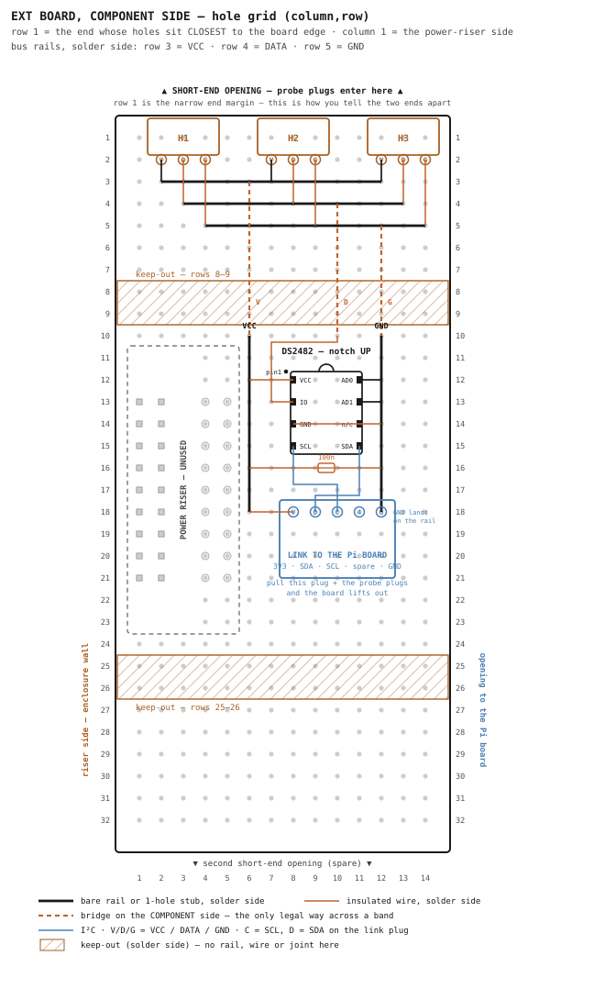

# DS18B20 Bus — Build Procedure

**Status:** Ready to build (EXT board + DS2482). Field-bus rules verified live on the Pi
(`10.0.0.82`, Pi 4 Model B, kernel `6.18.34+rpt-rpi-v8`). · **Owner:** David

Build procedure for the 1-wire side of the system: the **RPI-BC EXT-PCB HBUS SET** (Mouser
651-2202995) carrying the DS2482 converter, three probe sockets at the enclosure opening and
a pluggable link to the Pi board; the field chain out to the eight probes; and the software
switch from `w1-gpio` to the DS2482. Design reasoning and electrical background are in
Appendix A.

---

## 1. How to read this document

**Holes are named `(column,row)`.** Set the board up this way and the names are unambiguous:

- **Component side up** — the face marked `TOP` on Phoenix drawing 00913308/02 (in
  `~/OneDrive - DGLC/Claude/HVAC Manuals/`).
- **Row 1 at the top.** The two short ends are not identical: at one end the first row of
  holes sits **closer to the board edge** than at the other. That close end is **row 1**.
  Measure both ends before you start; it is the only way to tell them apart, and everything
  below depends on it.
- **Column 1 on the left.** With row 1 up, the **power-riser field** — two columns of pin
  holes with pre-wired traces, beside a column with no holes at all — falls on your left.
  That is column 1. If it lands on your right, the board is end-for-end: turn it around and
  re-check the end margins.

Columns run 1–14, rows 1–32. This is the drawing's TOP view turned 180° in the plane.

**Three conductors everywhere.** The bus is always the same trio: **VCC** (3.3 V probe
power), **GND**, and **DATA** (the 1-wire line, called DQ in datasheets). On every socket,
plug and cable in this document the order is VCC, DATA, GND.

**Faces and wire types** follow `docs/rpi-io-board-design.md` §1: components on the component
side, wires on the solder side; rails and one-hole stubs bare, everything else insulated
22 AWG solid; a wire never shares a hole with a pin — it lands on the copper ring beside the
pin's joint. "Ring (c,r)" below means exactly that. The one exception is a **bridge**: an
insulated wire that runs across the **component** side to get over a keep-out band, with its
two ends dropping through holes on either side.

## 2. What the finished system is

```
                       5-wire cable: 3V3 · SDA · SCL · spare · GND
                              ┌───────────────────────────┐
 Pi ──40-pin──► INT board ──┤PLUG├                     ┤PLUG├── EXT board ──► DS2482
                                                                     │
                                             VCC · DATA · GND bus ───┤
                                                                     ├─┤H1├─► TRUNK ─► 8 probes
                                                                     ├─┤H2├─► spare (outdoor)
                                                                     └─┤H3├─► spare
```

The DS2482 turns the Pi's I²C into 1-wire timing generated in hardware with a driven rising
edge — which is what an eight-probe run in a mechanical room wants, and why the discrete
pull-up and the old GPIO 4 wiring come off (Appendix A).

**Everything that leaves this board is on a plug.** The three probe sockets sit at the
short-end opening, and the five-way link to the Pi board lands on a pluggable terminal at
**each** end (a PTSM plug here, a screw-clamp plug on the Pi board), so the cable is
replaceable too. Pull four plugs and the EXT board lifts out of the enclosure without
touching the Pi board or the field wiring. Sensors keep their `28-*` names
throughout, so pivac, the calibration offsets and the InfluxDB history are untouched.

## 3. Parts

| Item | Part | Qty |
|---|---|---|
| 1-wire converter | **DS2482-100** (SOIC-8 on a DIP-8 adapter) | 1 |
| IC socket | DIP-8 | 1 |
| Probe sockets | **PTSM 0,5/3-HH-2,5-THR** print header, horizontal entry (order 1778560 black / 1815277 white) | 3 |
| Probe plugs | **PTSM 0,5/3-P-2,5** (order 1778845) | 3 |
| Link terminal | **PTSM 0,5/5-HH-2,5-THR** print header, horizontal entry | 1 |
| Link plug | **PTSM 0,5/5-P-2,5** | 1 |
| Decoupling | 100 nF ceramic | 1 |
| Link cable | 5-conductor, board to board — length measured at the dry-fit (the Pi-board terminal sits at its row 25, below the lower keep-out band) | 1 |
| Wire | insulated 22 AWG solid + a scrap of bare | — |

Removed, not added: the 2.2 kΩ pull-up and any series resistor — the DS2482 supplies its own
pull-ups and an external one fights it. Keep the pull-up in the spares box; it is the rollback
part.

**PTSM is 2.5 mm pitch and the board matrix is 2.54 mm.** Over three positions that is 0.08 mm
of drift and over four 0.12 mm, which a 0.65 mm pin in a 1.0 mm hole absorbs. Ease the outer
pins in; do not force them.

## 4. The EXT board's fixed features

### 4.1 The grid

14 columns × 32 rows of plated ⌀1.0 mm holes on a 2.54 mm pitch, isolated pads, no bus strips
— every rail has to be built. Three gaps, all on the riser side: **column 3 has no holes in
rows 11–23**, and columns 1–2 have none at rows 11, 12, 22 and 23. The gap column is the
quickest visual confirmation that you have column 1 on the correct side.

### 4.2 The power-riser field — leave it alone

Columns 1–5, rows 11–23: the riser's 18 pin positions at columns 1–2, the no-hole column 3,
and the pre-wired access pads at columns 4–5. The riser carries power up to the Pi board and
**this build does not use it**. Nothing is placed there, and no wire enters it.

### 4.3 Keep-out areas (solder side)

| Area | Holes covered |
|---|---|
| Upper band | rows 8–9, full width |
| Lower band | rows 25–26, full width |

No solder-side rail, wire or joint may sit in either band. **The component side is clear**,
which is what lets the three bridges in §5.3 cross the upper band. Everything else in this
build sits in rows 1–7 or rows 10–24, between the bands.

## 5. Placement map



*(Figure source: `docs/ds18b20-ext-board-layout.gen.py`.)*

### 5.1 Probe sockets

Three 3-position headers with their **pins in row 2** and their **entries facing the row-1
edge**, so the plugs go in through the short-end opening:

| Socket | VCC pin | DATA pin | GND pin | Use |
|---|---|---|---|---|
| **H1** | (2,2) | (3,2) | (4,2) | the trunk to the field chain |
| **H2** | (7,2) | (8,2) | (9,2) | spare — the outdoor run when it is restored |
| **H3** | (12,2) | (13,2) | (14,2) | spare / bench tap |

The bodies overhang the row-1 edge, which is what puts the plug entries at the opening. **Check
that overhang against the enclosure at the step-2 dry-fit before soldering anything** — it is
the one dimension this layout cannot settle from the drawing.

An empty socket adds nothing to the bus; a plug only becomes a branch when a cable lands in
it, so leave the spares empty without concern.

### 5.2 Bus rails

Three bare rails on the solder side, one per conductor, spanning the sockets:

| Rail | Row | Runs | Fed from the sockets by |
|---|---|---|---|
| **VCC** | 3 | (2,3) → (12,3) | bare 1-hole stubs at columns 2, 7, 12 |
| **DATA** | 4 | (3,4) → (13,4) | insulated jumpers (c,2) → (c,4) at columns 3, 8, 13 |
| **GND** | 5 | (4,5) → (14,5) | insulated jumpers (c,2) → (c,5) at columns 4, 9, 14 |

The DATA and GND jumpers cross over the rails above them. Bare rail, insulated jumper — that
is what makes the crossing safe, and why the rails go down before the jumpers.

### 5.3 Bridges over the upper band

Three insulated wires on the **component** side, each dropping through a hole at both ends:

| Net | From | To |
|---|---|---|
| VCC | (6,3) | (6,10) |
| DATA | (10,4) | (10,10) |
| GND | (12,5) | (12,10) |

Each bridge passes over the rails below its start on the component side and touches none of
them. Columns 6, 10 and 12 are deliberately not socket-pin columns, so no hole carries more
than two conductors.

### 5.4 DS2482 socket

DIP-8 socket at **columns 8 and 11, rows 12–15**, with the **notch facing row 11** (up, toward
the probe sockets). Pin 1 is the top-left pin, (8,12). The SOIC-8 sits on its adapter with pin
1 on the adapter's pin-1 mark.

| Hole | Pin | Name | Connects to |
|---|---|---|---|
| (8,12) | 1 | VCC | VCC rail (wire V1) |
| (8,13) | 2 | IO | the 1-wire DATA net (wire D1) |
| (8,14) | 3 | GND | GND rail (wire G1) |
| (8,15) | 4 | SCL | link terminal (wire S1) |
| (11,15) | 5 | SDA | link terminal (wire S2) |
| (11,14) | 6 | PCTLZ | **nothing — leave open** |
| (11,13) | 7 | AD1 | GND rail (bare stub) |
| (11,12) | 8 | AD0 | GND rail (bare stub) |

AD0 and AD1 at ground set I²C address `0x18`, which the software step expects.

### 5.5 Link terminal and decoupling

The 5-position header sits with its **pins in row 18** and its body facing row 19, clear of
both keep-out bands. Positions run straight through to the matching terminal on the Pi board,
so the cable is a plain five-conductor run with no crossovers:

| Pos | Hole here | Signal | Pi board pad (Pi pin) | Connects to |
|---|---|---|---|---|
| 1 | (8,18) | 3V3 | (5,2) — pin 1 | VCC rail (wire V3) |
| 2 | (9,18) | SDA | (5,3) — pin 3 | chip pin 5 (wire S2) |
| 3 | (10,18) | SCL | (5,4) — pin 5 | chip pin 4 (wire S1) |
| 4 | (11,18) | spare | (5,5) — pin 7, GPIO 4 | **nothing — parked** |
| 5 | (12,18) | GND | (5,6) — pin 9 | **the GND rail, which already lands on this pad** |

**The order is set by the Pi board, where those five signals sit on consecutive access pads**
(`docs/rpi-io-board-design.md` §5.5) — GPIO 4 falls between SCL and GND, which is why the
cable is five conductors rather than four. Position 4 is parked here; on a rollback to
`w1-gpio` it becomes the bus data line and moves to the DATA net, which is the whole of §9.

**The cable detaches at both ends** — the PTSM plug here, a screw-clamp plug on the Pi
board — so it is replaceable and either board lifts out alone. **Mark position 1 on both
boards, both plugs and the cable** — reversed, this link puts 3V3 on ground.

GND needs no wire at all: the rail already runs down column 12 to row 18, so it solders to
that pad and the connector pin drops into the same hole.

The **100 nF capacitor** goes across the two lower-field rails at **(9,16) and (10,16)**, body
flat between them, one hole below the chip.

### 5.6 Lower-field rails and wires

Two more bare rails run down the lower field, each starting at its bridge foot:

| Rail | Column | Runs |
|---|---|---|
| **VCC** | 6 | (6,10) → (6,18) |
| **GND** | 12 | (12,10) → (12,18) |

Then eleven connections. Bare where marked, otherwise insulated 22 AWG:

| # | Net | From | To | Note |
|---|---|---|---|---|
| V1 | VCC | rail at (6,12) | ring (8,12) | chip VCC |
| V2 | VCC | rail at (6,16) | hole (9,16) | capacitor |
| V3 | VCC | rail at (6,18) | ring (8,18) | link position 1 |
| G1 | GND | rail at (12,14) | ring (8,14) | chip GND, passing under the package |
| G2 | GND | rail at (12,16) | hole (10,16) | capacitor |
| — | GND | rail at (12,12) | ring (11,12) | **bare** 1-hole stub — AD0 |
| — | GND | rail at (12,13) | ring (11,13) | **bare** 1-hole stub — AD1 |
| D1 | DATA | bridge foot (10,10) | ring (8,13) | left along row 10, down column 7, in to IO |
| S1 | SCL | ring (8,15) | ring (10,18) | down and right, crossing S2 once |
| S2 | SDA | ring (11,15) | ring (9,18) | down and left, crossing S1 once |

G1 runs beneath the DIP package on the solder side, which is fine — the package is on the
other face. S1 and S2 cross once between rows 16 and 17; run one a few millimetres above the
other so the crossing is a clean right angle. Every other run stays in the free columns 6, 7
and 12.

## 6. Build sequence

The bus is live today, so from step 3 on it is down. Do it in one sitting and expect the
30-minute freshness alerts if it runs long.

1. **Identify the board.** Measure both end margins and mark row 1. Confirm the riser field
   and the no-hole column are on the left. Meter check: two adjacent free holes must not beep
   (no hidden bus strips). Identify the DS2482's pins on the bench against the §5.4 table and
   the adapter's pin-1 mark.
2. **Dry-fit, cover on.** Place the three probe sockets at row 2, the DIP socket, and the link
   terminal without soldering. Confirm the socket bodies clear the enclosure and their entries
   line up with the short-end opening; confirm the link terminal and its plug clear the lid;
   confirm the link cable reaches the Pi board's link terminal (its row 25, below the lower
   keep-out band) through the long-side opening. **If the socket
   overhang fouls the case, move all three one row in — pins to row 3, rails to rows 4, 5, 6,
   VCC bridge from (6,4)** — and carry that one-row shift through the rest of the build.
3. **Strip the old arrangement.** Unplug the trunk, remove the 2.2 kΩ pull-up, the GPIO 4 data
   wire and any series resistor.
4. **Solder the fixed parts**, lowest first: the DIP socket (two diagonal pins, check it sits
   flat, then the rest), the three probe sockets, the link terminal. Chip stays out.
5. **Rails, then jumpers, then bridges, then wires** — §5.2, §5.3, §5.6 in that order, then
   the capacitor.
6. **Check before the chip goes in.** Continuity from each socket's VCC pin to the chip's
   VCC ring and to link position 1 (8,18); the same for DATA (to the chip's IO ring) and GND
   (to link position 5, (12,18)). Then silence between every pair: VCC↔GND, VCC↔DATA,
   DATA↔GND, and every net ↔ PCTLZ (11,14) and ↔ the parked position 4 (11,18). SCL
   (8,15)↔(10,18) beeps; SDA (11,15)↔(9,18) beeps; SCL↔SDA stays silent.
7. **Software, then chip.** Run §8's config edit and reboot with the socket still empty. Power
   off, seat the DS2482 (notch up), power on: `i2cdetect -y 1` shows `0x18`.
8. **Bring the bus up.** Instantiate per §8, plug the trunk into H1, and
   `cat /sys/bus/w1/devices/w1_bus_master1/w1_master_slave_count` reads **8**. The eight `28-*`
   names match the roster in CLAUDE.md, and Signal K values resume within one `pivac-1wire`
   cycle — no restart needed, the module re-scans every cycle.

## 7. The field bus

The rules, in build order — reasons in Appendix A:

1. **One trunk, no branches.** The cable leaves the H1 plug, visits each sensor location in
   physical order, and ends at the last one. Nothing branches at the board, no spur doubles
   back, nothing hangs open.
2. **A block at each location, not a hub at the Pi.** Four locations, four blocks: tees
   (`IN`, `OUT`), tank (`UBT`, `LBT`), loop A, loop B. Each block is three 4-way lever
   connectors — one per conductor — carrying trunk-in, trunk-out and its two probes. Add a
   **100 nF ceramic across VCC–GND at each block**.
3. **Trim every probe lead** to the shortest length that reaches its block. Coiled slack
   defeats the exercise.
4. **DATA and GND share one twisted pair; VCC rides in the same cable.** On CAT5e/6:
   white/orange = DATA, orange = GND, blue = VCC, white/blue = second GND. Green and brown
   pairs stay open at both ends; never put anything spare on DATA, and never pair DATA with
   VCC.
5. **Measure, don't estimate.** Multimeter in capacitance mode, far end open, DATA lifted at
   the board: DATA-to-GND across the installed cable. Under ~2 nF the DS2482 drives it with
   ease; the working record here is 1.75 nF measured, arithmetic in Appendix A.

```
   H1 plug ═ trunk ═►│ BLOCK 1 │═►│ BLOCK 2 │═►│ BLOCK 3 │═►│ BLOCK 4 │ ends here
                     │  tees   │  │  tank   │  │ loop A  │  │ loop B  │
                        │  │        │  │        │  │        │  │
                       IN OUT     UBT LBT     A_SUP…     B_SUP…
```

Mechanical rules for anything in the utility room: every conductor in a screw or spring
terminal (no mid-air joints, no wire nuts), ferrules on stranded wire, strain relief at every
enclosure entry, each branch labelled with the probe name it serves
(`docs/PhoenixContact-BC-RPI-label.docx` convention).

## 8. Software

Facts already verified on this Pi: the kernel ships `ds2482.ko` (binds `ds2482` and `ds2484`),
its `active_pullup` defaults on, no device-tree overlay ships so the device is instantiated
over sysfs, and the live config file is `/boot/firmware/config.txt` (`/boot/config.txt` is a
do-not-edit stub). `/dev/i2c-20`/`21` are HDMI buses; the header bus appears as `/dev/i2c-1`.

1. Edit `/boot/firmware/config.txt`: `dtparam=i2c_arm=on` (line 6), and comment out
   `dtoverlay=w1-gpio` under `[all]` (line 52) — two masters at once makes sensor ownership
   ambiguous. Reboot.
2. `sudo apt install -y i2c-tools`, then `i2cdetect -y 1` → device at `0x18`. Nothing there
   means AD0/AD1 aren't grounded or the chip isn't powered.
3. Instantiate: `sudo modprobe ds2482` then
   `echo ds2482 0x18 | sudo tee /sys/bus/i2c/devices/i2c-1/new_device` — `w1_bus_master1`
   reappears backed by the bridge, same `28-*` names.
4. Survive reboots: `echo ds2482 | sudo tee /etc/modules-load.d/ds2482.conf` and install
   `scripts/systemd/ds2482-init.service`:

```ini
[Unit]
Description=Instantiate the DS2482 1-Wire master on I2C
After=sysinit.target
Before=pivac-1wire.service

[Service]
Type=oneshot
RemainAfterExit=yes
ExecStart=/bin/sh -c 'test -e /sys/bus/w1/devices/w1_bus_master1 || echo ds2482 0x18 > /sys/bus/i2c/devices/i2c-1/new_device'

[Install]
WantedBy=multi-user.target
```

```bash
sudo cp ~/github/pivac/scripts/systemd/ds2482-init.service /etc/systemd/system/
sudo systemctl daemon-reload && sudo systemctl enable --now ds2482-init
```

Start ordering is a convenience: `pivac.OneWireTherm` re-scans the bus every cycle, so a
late-appearing master self-heals. No pivac code change and no `/etc/pivac/config.yml` edit —
the PR #122 calibration offsets key off the unchanged `28-*` names. With the DS2482 in,
`pivac/GPIO.py:17`'s vestigial `os.system('modprobe w1-gpio')` goes too.

## 9. Rollback

Pull the DS2482 out of its socket, refit the 2.2 kΩ pull-up between the DATA and VCC rails,
and move **one wire**: the parked link position 4 (11,18), which is already tied to the Pi's
GPIO 4 through the cable, goes to the DATA net. Uncomment `dtoverlay=w1-gpio` and reboot.
`i2c_arm=on` and the module-load file are harmless left in place. Carrying GPIO 4 in the cable
is what makes this a one-wire change rather than a rewire.

---

## Appendix A — design decisions and electrical background

**Why the probe sockets are at the short end.** The enclosure is open at both short ends and
at one long side; the long side carrying the riser traces is closed. Field cables therefore
have to leave through a short end, which puts the sockets in row 2 with their entries facing
the row-1 edge. Row 1 rather than row 32 because that end's holes sit closer to the board
edge, so the plug entries land closest to the opening.

**Why every cable is a plug, and why the link is five-way.** The DS2482 needs four conductors
from the Pi (3V3, GND, SDA, SCL), so a 3-pin disconnect cannot sit on the Pi side of the
converter. On the Pi board those four arrive on consecutive access pads with **GPIO 4 sitting
between SCL and GND**, so no four-position window spans them; taking five lands the terminal
straight on the pads with no wires and carries the rollback line as a bonus. With plugs at
both ends of the link and on all three probe sockets, either board is a line-replaceable unit
and the cables themselves are replaceable. Unplugging a 1-wire bus is clean — the kernel keeps
polling, the module logs a sensor-count change and recovers when it returns.

**Why a chain and not a star.** Every open-ended cable branch reflects the signal's edges
back at a delay set by its length. Four short branches kept the echoes clear of the moment the
master reads the line; eight put them on top of it. A chain has one line, one far end, one
echo. This is what took the bus from four healthy sensors to zero on 2026-08-22 — the kernel
signature is `w1_search: max_slave_count 64 reached` followed by a count of 0 (phantom devices
from corrupted address-search bits, not 64 sensors). The failure is silent in pivac: the
service stays `active`, only the freshness alerts report it.

**Distributed blocks are a chain; clustered blocks are a star.** All ports of a lever block
are one node, so blocks side-by-side at the Pi leave every probe lead a full-length branch.
One block *at each sensor*, trunk block to block, probe leads trimmed short — that is the
chain, and more serviceable than splices.

**The pull-up arithmetic, kept for diagnosis.** On `w1-gpio` the line rises through the
pull-up alone, and the master samples ~15 µs in, leaving ~9 µs of rise budget (~1.2 RC time
constants). Measured DATA–GND capacitance against that budget:

| Measured | 4.7 kΩ | 2.2 kΩ |
|---|---|---|
| 500 pF | 2.8 µs | 1.3 µs |
| 1.5 nF (this bus, measured) | 8.5 µs — marginal | 4.0 µs |
| 3 nF | 17 µs — fails | 7.9 µs — marginal |

The DS2482's driven edge removes the row entirely — and is why the discrete pull-up comes off
(the part has its own weak plus active pull-up; an external resistor fights the active one),
and why no series damping resistor belongs in front of it either.

**Cable: pairing matters, category doesn't.** CAT5e and CAT6 both run ~50 pF/m; 1-wire at
~15 kbps cares only about capacitance and which conductor is DATA's neighbour. Jacketed
3-conductor (thermostat wire style) puts DATA between VCC and GND at ~112 pF/m — 2.2× worse —
which is what the 45.5 ft bus inventory closed on. Shielded cable trades pickup rejection for
added capacitance: plain UTP first; shielded only for intermittent CRC errors, drain grounded
at the board end only.

**Voltages must match end to end.** The probes run at 3.3 V, so DATA's high level must be
3.3 V — the DS18B20's limit is VDD + 0.3 V. The DS2482 powered from the Pi's 3.3 V keeps that
automatic. Moving the bus to 5 V (native 1-wire, more noise margin) is possible with the
bridge but means moving probe VCC to 5 V at the same time; never mix the rails. (The Arduino
bench rig runs 5 V throughout — correct there, wrong here.)

**The outdoor run gets its own bus when it returns.** A second DS2482 at address `0x19`
(AD0 high) on the same I²C link gives the outdoor cable — the longest and most exposed on the
system — a master of its own, so a fault out there cannot blank the mechanical-room probes.
H2 is reserved for it; sensors from every master appear flat under `/sys/bus/w1/devices/`, so
pivac needs nothing. Sequence it last, after the chain is proven, with spare calibrated probes
PA4/PA5 (offsets in `docs/ds18b20-PA1-5-calibration.md`). When it returns,
`environment.outside.temperature` gets a freshness rule under a **new UID** — its old UID sits
permanently in `sensor-freshness.yaml`'s `deleteRules:` block and cannot be revived.
`sentry-outdoor-divergence` needs no change.

**DS2484 and commercial boards.** The DS2484 adds tunable timing but the stock driver only
exposes `active_pullup`/`extra_config`, so the tuning is unreachable — the DS2482-100 is the
right part. Off-the-shelf alternatives if hand-soldering the SOIC ever annoys: AB Electronics
1 Wire Pi Plus, Sheepwalk RPI3. Fit ESD protection on the 1-wire port if the build lacks it —
a mechanical-room run is an antenna and the DS2482 is all that stands before the Pi.

**Per-branch damping resistors** (100 Ω in each branch's DATA at a hub, Maxim AN148) are the
mitigation for a star that cannot be re-cabled. A chain does not want them, and neither does
the DS2482's driven edge. Recorded so the option stays a decision, not a discovery.
