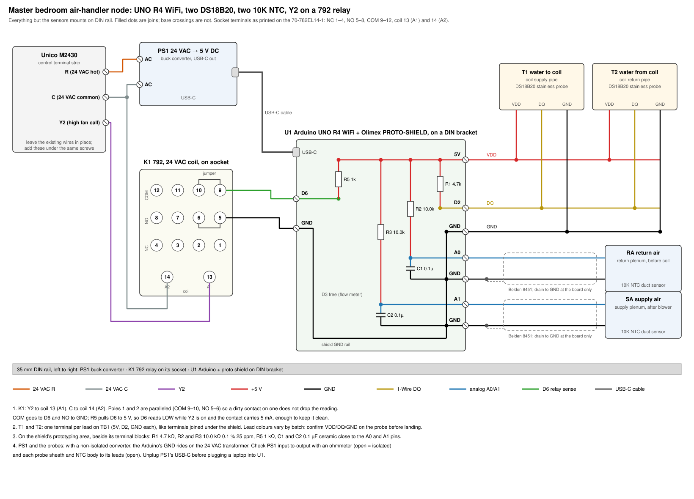

# Master bedroom air-handler node: wiring and sketch plan

An Arduino UNO R4 WiFi at the master bedroom's Unico M2430 reads five signals: the water entering and
leaving the coil, the air entering and leaving the air handler, and the thermostat's Y2 call, which
is the high fan stage. pivac polls it over WiFi and publishes to Signal K, the same path the DHW
and boiler pressure boards use. The case for measuring this coil, and the physics the data feeds,
are in `docs/unico-cooling-assessment-and-tuning.md` §4.4, §4.6, §5.10 and Appendices E to G. This
document is the build: wiring, the sketch, the pivac side and the checks.

The node carries no water flow meter. Pin D3 is left free for one, since Appendix E.6 says Loop A
needs a per-coil meter before the node can report capacity in BTU/h. Without it the node still
answers the questions that matter now: whether the coil is short of water, short of air or
overloaded when the room loses setpoint, and how much of each call runs on the high fan stage.

The first question is already pressing. The room runs 2 °F over setpoint from late morning into
early afternoon at the same hours whatever the outdoor temperature, with the water side and the
strainer measured sound (§5.10 of the assessment). The return-air sensor shows whether the room is warm or only the thermostat is, and
`y2` shows whether the coil was already on its high fan stage while it lost ground.

## 1. What the node measures

| Signal | Sensor | Pin | Field |
|---|---|---|---|
| Water to coil | DS18B20 | D2 | `wsup` |
| Water from coil | DS18B20 | D2 | `wret` |
| Return air | 10K NTC | A0 | `aret` |
| Supply air | 10K NTC | A1 | `asup` |
| Y2 call | 792 relay, 24 VAC coil | D6 | `y2`, `y2_s` |

All temperatures go out in °F at two decimals, and pivac converts them to Kelvin. `y2` is the call
right now, 0 or 1. `y2_s` counts the seconds Y2 has been asserted since boot, so the Pi can take
the stage-2 fraction from its derivative without missing a short burst between polls. The line
also carries `uptime_ms` and `rssi`, for diagnosing reboots and the attic's WiFi.

## 2. Board, power and mounting

The board is an UNO R4 WiFi, the same as every other pivac node, with an Olimex PROTO-SHIELD on
top. The shield has no terminals of its own, so a row of PCB terminal blocks soldered along one edge
of its prototyping area takes every field wire, and the six small parts solder beside them. The
blocks are 2.54 mm pitch, which drop straight into the shield's grid but take one 22 AWG conductor
per terminal, so every wire gets its own terminal and like wires join on the underside. That makes
fourteen positions in three blocks, one per cable group: a 6-way for the two probes, a 6-way for
the two air sensors and a 2-way for the relay (§3.4). Land each wire bare, stripped about 5 mm.
The R4's pins run at 5 V, and its ADC reads 14 bits against the board's own 5 V rail.

Everything except the sensors mounts on one 35 mm DIN rail at the air handler, left to right: the
buck converter, the 792 relay on its socket, and the Arduino on an Adafruit 4557 DIN bracket.
`docs/mbr-air-handler-node-wiring.svg` is the wiring drawing, generated by
`docs/mbr-air-handler-node-wiring.gen.py`.

Power comes from the Unico's own 24 VAC transformer through a 24 VAC to 5 V DC buck converter with
a USB-C output, into the R4's USB-C port. The node draws about 1 W, which with the converter's loss
and the relay coil's 1.2 VA adds about 3 VA to the transformer. Read the transformer's nameplate VA
and confirm that margin before wiring it.

Most 24 VAC buck converters are not isolated: a bridge rectifier feeds the regulator, so the 5 V
side's ground swings against C every half-cycle. That is safe only while nothing else ties the
Arduino's ground to C or to earth. The relay keeps Y2 off the Arduino, so two checks remain:

1. Ohmmeter from each converter input terminal to its output ground. Open means isolated and
   nothing more is needed.
2. If it is not isolated, ohmmeter from each probe's stainless sheath to its three leads, and from
   each NTC's body to its two leads, all open. A sheath shorted to a lead on a bonded copper pipe
   would put the transformer's secondary across a rectifier diode.

Unplug the converter's USB-C from the R4 before plugging a laptop in to flash it, so the laptop
never shares a ground with the 24 VAC side.

## 3. Wiring

The drawing carries every connection; this section gives the reasons and the checks.



### 3.1 Water temperatures, DS18B20 on D2

Both probes share one 1-Wire bus on the R4's D2, powered from its 5 V, with one 4.7 kΩ pull-up (R1)
from 5 V to D2 on the shield. The R4 runs its logic at 5 V, so the bus and the pull-up must both be
at 5 V; a 3.3 V pull-up leaves the bus answering presence while every ROM search returns nothing.

| Probe lead | Shield terminal |
|---|---|
| VDD, T1 and T2 | 5V, one each |
| DQ, T1 and T2 | D2, one each |
| GND, T1 and T2 | GND, one each |

Each probe has its own three terminals, and the two 5V, two D2 and two GND terminals are joined on
the underside. Lead colours are not
consistent between batches of stainless probes, so identify VDD, DQ and GND from the probe's own
documentation before landing them, and confirm with the bring-up log (§4.8): two ROMs listed means
the wiring is right, and no ROMs with the bus held low or reading empty means a lead is swapped.

The probes' own leads are about 1 m. If the coil piping is farther than that from the rail, extend
each probe with CAT6 rather than more three-core cable, following rule 4 of
`docs/ds18b20-bus-topology.md`: white/orange DQ, orange GND, blue VDD, white/blue a second GND, the
green and brown pairs open at both ends. Keep the whole bus under 10 m; at that length a 4.7 kΩ
pull-up has room to spare.

Use the PA5 pair, PA5A `28-000000cb6e28` and PA5B `28-0000001a8cda`, the one calibrated pair not in
service. They were bench-matched in the same bath as the loop probes (ice-point offsets +0.320 and
+0.089 K in `docs/ds18b20-PA1-5-calibration.md`), and a matched pair is what a coil ΔT wants. PA5
was noted as the candidate for a future outdoor probe; that run needs one probe, and the spare CRW
(`28-0316a00f04ff`) can take it.

The sketch addresses each probe by its ROM, set in the zone's `.ino`, so supply and return can
never swap if the bus enumerates them in a different order. Record which probe went on which pipe
in this document at the build.

Strap each probe to bare, cleaned copper on the coil's supply and return, as close to the coil
connections as the pipe allows and at least five diameters from a fitting. Use thermal compound
and a stainless clamp, then 25 mm of insulation extending 100 mm each side (Appendix E.3). Mount
the two identically, so a residual mounting error is common to both and cancels out of the ΔT.
Strain-relieve each cable to the pipe an inch or two behind the probe.

### 3.2 Air temperatures, 10K NTC on A0 and A1

An ADC measures voltage, and an NTC is a resistance, so each sensor needs a known resistor in
series to turn its resistance into a voltage. R2 runs from 5 V to A0 and the return-air NTC from A0
to GND; R3 and the supply-air NTC do the same on A1. The pin then reads
5 V × R_ntc ÷ (R_ntc + 10.0 kΩ), and the sketch solves for R_ntc. Because the divider and the ADC
reference are the same 5 V rail, supply variation cancels. The fixed resistor's tolerance and drift
become temperature error directly: 0.1 % at 25 ppm/°C costs about 0.04 °F, where a 1 % part would
cost 0.4 °F.

There are two capacitors, C1 on A0 and C2 on A1, 0.1 µF from each pin to GND. Each does two jobs.
The ADC samples by charging a small internal capacitor in a few microseconds, and through a 5 kΩ
divider that charge cannot arrive in time; the 0.1 µF holds the pin's voltage steady and hands the
ADC that charge at once. With the divider it also forms a low-pass filter at about 300 Hz, which
removes hum and blower-motor noise the sensor cable picks up along the duct. Fit both on the shield
close to their pins.

Run each NTC on its own Belden 8451 shielded pair: one conductor to the A terminal, the other to the GND
terminal beside it, the drain to the SH terminal after that, which joins GND on the underside, and the drain cut back and taped at the sensor
end so the shield is grounded at one end only.

Measure each sensor's resistance at room temperature before wiring. About 10 kΩ at 77 °F confirms
a 10K part. Honeywell also sells 20K duct sensors, and a 20K part wants 20.0 kΩ for R2 and R3.

Put the return sensor in the return plenum ahead of the coil, out of sight of the coil face. Put
the supply sensor in the supply plenum after the blower and before the first takeoff, where the
blower has mixed the air. Shield both from radiation, seal the supply probe's body, and route its
leads downward, because in cooling it sits in air near saturation (Appendix E.4).

### 3.3 Y2 call, 792 relay on D6

The relay is a Magnecraft 792 with a 24 VAC coil, on a 70-782EL14-1 socket, the pairing the CDP's
`HPHEAT` and `HPCOOL` relays use. Socket terminals as printed: NC 1–4, NO 5–8, COM 9–12, coil 13
(A1) and 14 (A2), each pole a column (1·5·9, 2·6·10, and so on).

1. Coil: Y2 from the Unico's terminal strip to 13, C to 14, both added under the existing screws.
   The coil draws 0.9 to 1.2 VA, about 50 mA, which a thermostat output carries easily.
2. Contacts: pole 1 and pole 2 in parallel, with a jumper from COM 9 to COM 10 and another from
   NO 5 to NO 6. COM 9 goes to D6 and NO 5 to a GND terminal. Either pole closing pulls D6 low, so one
   oxidised contact cannot hide a call.
3. Pull-up: R5, 1 kΩ from 5 V to D6 on the shield. D6 reads high with Y2 off and low with Y2 on.

The pull-up sets the current through the closed contact at 5 mA. The 792's silver-alloy contacts
are rated for loads of 10 mA at 17 V or more, and a contact switching far less than that can
build an oxide film that stops it conducting. Its contacts are gold-flashed, the enclosure is
clean and dry, and two poles share the job, so 5 mA at 5 V is workable. If D6 ever reads high
while the relay's mechanical flag shows it pulled in, drop R5 to 470 Ω for 10 mA.

A thermostat output's off-state leakage cannot pull in a coil that needs 19 V to operate, and the
coil keeps the 24 VAC side off the Arduino. The relay releases within 35 ms of Y2 dropping.

Before wiring, confirm with a meter that the screw marked Y2 on the Unico reads 24 VAC to C during
a high-fan call and near zero otherwise.

### 3.4 Shield terminal map

| Terminal | Wires |
|---|---|
| Block | Terminal | Wire |
|---|---|---|
| TB1, 6-way | 5V | T1 VDD |
| | D2 | T1 DQ |
| | GND | T1 GND |
| | 5V | T2 VDD |
| | D2 | T2 DQ |
| | GND | T2 GND |
| TB2, 6-way | A0 | Return-air NTC |
| | GND | Return-air NTC |
| | SH | Return-air drain |
| | A1 | Supply-air NTC |
| | GND | Supply-air NTC |
| | SH | Supply-air drain |
| TB3, 2-way | D6 | K1 COM 9 |
| | GND | K1 NO 5 |
| — | USB-C | Buck converter |

Each terminal is wired on the underside to its header pin. On the prototyping area: R1 4.7 kΩ from 5V to D2, R2 and R3 10.0 kΩ from 5V to A0 and A1, C1 and
C2 0.1 µF from A0 and A1 to GND, and R5 1 kΩ from 5V to D6.

Avoid D0 and D1 (serial), D4 and D5 (CAN) and D10 to D13 (SPI). The free general-purpose pins
after this build are D3, D7, D8 and D9, and D3 is kept for a flow meter.

## 4. Sketch

### 4.1 Layout in the Arduino repo

The sketch lives in `~/github/Arduino` beside the pressure and water sketches, built to take more
zones without copying code:

| Path | Contents |
|---|---|
| `AirHandler/AirHandler_impl.h` | All logic |
| `AirHandler_MBR/AirHandler_MBR.ino` | Zone constants, then `#include` |
| `AirHandler_MBR/AirHandler_impl.h` | Symlink to the shared file |
| `AirHandler_MBR/arduino_secrets.h` | WiFi credentials, gitignored |

This is the pattern `ArduinoPSI_impl.h` already uses for the two pressure boards. A second zone is
a new folder with its own `.ino`, its own ROMs and its own secrets.

The zone file defines only what differs between air handlers:

```cpp
// AirHandler_MBR.ino
#define ZONE_TAG       "MBR"
// DS18B20 ROMs, read from the serial log in bring-up mode (section 4.8)
#define ROM_WSUP       { 0x28, 0x00, 0x00, 0x00, 0x00, 0x00, 0x00, 0x00 }
#define ROM_WRET       { 0x28, 0x00, 0x00, 0x00, 0x00, 0x00, 0x00, 0x00 }
// NTC curve: nominal resistance at 25 C and beta, from the data sheet, then checked (section 6)
#define NTC_R0_OHM     10000.0f
#define NTC_BETA       3950.0f
#define NTC_RREF_OHM   10000.0f
#include "AirHandler_impl.h"
```

### 4.2 Reliability scaffolding, copied from `ArduinoPSI_impl.h`

The new header reuses the pressure boards' proven skeleton unchanged: the RA4M1 watchdog armed
first in `setup()` and refreshed each `loop()` at 5 s, the bounded `connectWiFi()` that resets the
board with `NVIC_SystemReset()` after 20 s, the 2 s cap on serving one HTTP client, and the
single-line single-quoted response that `pivac.ArduinoSensor` parses with `ast.literal_eval`.
`loop()` must never block, so every sensor read below is non-blocking.

### 4.3 Loop timing

| Task | Cadence | Blocking |
|---|---|---|
| Watchdog refresh | Every loop | No |
| WiFi check | Every 1 s | No |
| Y2 sample | Every loop | No |
| ADC sample, A0 and A1 | Every loop, into accumulators | No |
| Air temperature publish | Each 1 s block | No |
| DS18B20 read and restart | Every 2 s | No |
| HTTP client | When one connects | 2 s cap |
| LED matrix | Every 1 s | No |

### 4.4 Water temperatures

`DallasTemperature` with `setResolution(12)` and `setWaitForConversion(false)`, exactly as the DHW
board runs it. Every 2 s the sketch reads both probes by ROM with `getTempF(rom)`, then calls
`requestTemperatures()` to start the next conversion, which takes 750 ms and so is always finished
by the following read. A read that returns `DEVICE_DISCONNECTED_F` (−196.6 °F) or the power-on
value of exactly 185.0 °F is a fault, and the field is left out of the response (§4.7).

### 4.5 Air temperatures

`analogReadResolution(14)` in `setup()`. Each loop adds one reading from A0 and one from A1 to a
running sum; once a second the sketch divides by the count, converts, and stores the result. The
WiFi status call is the slow part of a loop, which is why it runs once a second, and the loop then
turns over hundreds of times a second, more than the 100 to 256 samples Appendix E.4 asks for.

The conversion, with the NTC on the low side of the divider:

```cpp
float ntcF(float counts) {
  if (counts < 50 || counts > 16333) return NAN;            // open or shorted sensor
  float r  = NTC_RREF_OHM * counts / (16383.0f - counts);   // NTC resistance, ohms
  float k  = 1.0f / (1.0f / 298.15f + logf(r / NTC_R0_OHM) / NTC_BETA);
  return (k - 273.15f) * 9.0f / 5.0f + 32.0f;
}
```

The beta equation is within a few tenths of a degree of Steinhart-Hart from 40 to 100 °F, and the
two-point check in §6 measures the residual. Near room temperature one ADC count is about 0.01 °F,
so averaging, not resolution, sets the floor. Per-sensor offsets belong in pivac's config, never in
the sketch.

### 4.6 Y2

D6 is an `INPUT` (R5 is the pull-up), and the relay pulls it low while Y2 is on. Each loop reads
D6. A low sample sets `y2` to 1 at once. `y2` returns to 0 only after D6 has read high on every
sample for 100 ms, so contact bounce at release cannot produce a false edge, and a loop stalled for
up to 2 s on an HTTP client cannot either: the first sample after the stall either confirms the
call or starts the 100 ms clock. On each 0 to 1
change the sketch notes the time; on each 1 to 0 change it adds the elapsed time to a running
total. `y2_s` is that total plus the current call if one is open, in whole seconds since boot.

### 4.7 Response

One line, single-quoted, fields only for sensors that read correctly this cycle:

```
{'wsup' : 49.81, 'wret' : 55.37, 'aret' : 76.12, 'asup' : 58.40, 'y2' : 1, 'y2_s' : 4312, 'rssi' : -61, 'uptime_ms' : 84213021}
```

A faulted sensor is left out of the line entirely, never sent as a sentinel. `pivac.ArduinoSensor`
has no sentinel handling: it would convert −999 °F to Kelvin and publish it as a reading. A missing
key makes it log one warning and skip that path, so Signal K shows the path going stale, which the
freshness alert reports. Build the line with `snprintf` into a 256-byte buffer, appending each
field only if its value is finite.

### 4.8 Bring-up mode

On boot, before WiFi, the sketch prints every ROM on the 1-Wire bus and the raw ADC counts for A0
and A1 to the serial port for ten seconds. That is how the two ROMs get into the zone's `.ino`:
warm one probe in a hand, watch which ROM's reading rises, and record which pipe it goes on. The
same log confirms each NTC reads mid-scale (about 8,000 counts at room temperature) before it goes
into a plenum.

### 4.9 LED matrix

The matrix cycles each second through `S58` (supply air), `R76` (return air) and `W6` (water ΔT,
return minus supply), with a dot in the corner while Y2 is asserted. Anyone opening the cabinet can
see the node is alive and the call it is seeing without a laptop.

## 5. pivac and Signal K

### 5.1 Data path

pivac polls the board over HTTP, as it does the pressure boards. The board holds no Signal K
credentials or token, the calibration offsets stay in version-controlled config on the Pi, and
the watchdog, freshness alerts and backup restarts already cover this shape of service. Pushing to
Signal K from the board would need a JWT stored in its flash, renewed when it expires, and a
WebSocket client on the R4, and it would bypass all of that.

### 5.2 Config

The section is named for the air handler and loads `pivac.ArduinoSensor`. When a flow meter
arrives, the `module:` line changes to the `pivac.UnicoAH` wrapper of Appendix F.2, which adds the
derived capacities, and no Signal K path changes.

```yaml
pivac.UnicoAH_MBR:
    description: Master bedroom Unico M2430, coil water and air temperatures and the Y2 call
    module: pivac.ArduinoSensor
    enabled: true
    ipaddr: 10.0.0.xxx
    rounding: 2
    inputs:
        wsup:
            sk_path: environment.inside.hvac.ah.mbr.water
            outname: supply
            type: temperature
            offset: 0.0     # kelvin, from the pair calibration in section 6
        wret:
            sk_path: environment.inside.hvac.ah.mbr.water
            outname: return
            type: temperature
            offset: 0.0
        aret:
            sk_path: environment.inside.hvac.ah.mbr.air
            outname: return
            type: temperature
            offset: 0.0
        asup:
            sk_path: environment.inside.hvac.ah.mbr.air
            outname: supply
            type: temperature
            offset: 0.0
        y2:
            sk_path: environment.inside.hvac.ah.mbr
            outname: y2
        y2_s:
            sk_path: environment.inside.hvac.ah.mbr
            outname: y2Seconds
        uptime_ms:
            sk_path: environment.inside.hvac.ah.mbr
            outname: uptimeMs
```

### 5.3 Signal K paths

| Path | Unit |
|---|---|
| `environment.inside.hvac.ah.mbr.water.supply.temperature` | K |
| `environment.inside.hvac.ah.mbr.water.return.temperature` | K |
| `environment.inside.hvac.ah.mbr.air.supply.temperature` | K |
| `environment.inside.hvac.ah.mbr.air.return.temperature` | K |
| `environment.inside.hvac.ah.mbr.y2` | 0/1 |
| `environment.inside.hvac.ah.mbr.y2Seconds` | s |
| `environment.inside.hvac.ah.mbr.uptimeMs` | ms |

These match Appendix F.3, whose `<unit>` level lets a second air handler arrive as `ah.kids`
without renaming this one. The water and air ΔT are computed in Grafana from the pairs, and the
stage-2 fraction is the derivative of `y2Seconds` over the time `MASTER_BR.statenum` reads −1.

### 5.4 pivac changes

1. `pivac/ArduinoSensor.py` gains a per-input `offset:` in Kelvin, applied before rounding, as
   `pivac.OneWireTherm` already does. The same change lets the DHW recirc probe's parked +0.274 K
   correction be applied.
2. `scripts/systemd/pivac-ah-mbr.service`, a copy of `pivac-arduino-psi.service` running
   `pivac.UnicoAH_MBR` at `--loglevel WARNING`.
3. `scripts/nas-image-backup.sh`: add `pivac-ah-mbr` to both `STOP_SVCS` and `START_SVCS`.
4. `grafana/provisioning/alerting/sensor-freshness.yaml`: one freshness rule on
   `ah.mbr.air.return.temperature`, shipped `isPaused: true` and unpaused once the path publishes.
5. `scripts/arduino-watchdog.sh` is not extended. The new board is not on the Arduinos Shelly plug,
   so the watchdog cannot power-cycle it; its own WDT and WiFi reset are the recovery.
6. `CLAUDE.md`: the Active Services table, the restart, stop and log commands, the Current
   Modules entry, and the board's MAC and IP. The Arduino repo's `CLAUDE.md` gains the board in its
   hardware table.
7. A DHCP reservation on the UCG for the board's MAC.

## 6. Calibration and commissioning

1. On the bench, bundle the two DS18B20s in a stirred insulated jug and log 15 minutes at room
   temperature and 15 in ice water. The mean difference at each point is the pair offset; split it
   between the two `offset:` keys (Appendix G.1).
2. Put both NTCs in the same jug beside a DS18B20 at the same two points. The ice bath checks
   `NTC_BETA`: if both NTCs read the same error at 32 °F and at room temperature, it is an offset;
   if the error changes between the two points, adjust beta until it doesn't, then set offsets.
3. With the node installed, set the thermostat's fan to On with no call for 20 minutes. `asup` and
   `aret` should then agree within 0.3 °F, and the return air should track the RedLink room
   temperature within the thermostat's whole-degree reporting.
4. On the first cooling call, `wret` must read above `wsup` and `asup` below `aret`. A reversed
   sign is a swapped probe.
5. Force a high-fan call at the thermostat and confirm `y2` reads 1 within one poll, then 0 when it
   ends, and that `y2Seconds` advanced by the length of the call.

## 7. Parts

| Ref | Part | Qty | Digi-Key | Amazon |
|---|---|---|---|---|
| U1 | Arduino UNO R4 WiFi, ABX00087 | 1 | [ABX00087](https://www.digikey.com/en/products/detail/arduino/ABX00087/20371539) | [search](https://www.amazon.com/s?k=Arduino+UNO+R4+WiFi+ABX00087) |
| — | Olimex PROTO-SHIELD, ordered | 1 | [1188-1055-ND](https://www.digikey.com/en/products/result?keywords=1188-1055-ND) | [search](https://www.amazon.com/s?k=Olimex+PROTO-SHIELD+Arduino) |
| TB1–TB3 | PCB screw terminal blocks, 2.54 mm pitch: two 6-way and one 2-way, on hand | 3 | — | — |
| — | Adafruit DIN rail bracket, 4557 | 1 | [4557](https://www.digikey.com/en/products/detail/adafruit-industries-llc/4557/11684810) | [search](https://www.amazon.com/s?k=Adafruit+4557+DIN+rail+bracket) |
| T1, T2 | PA5A and PA5B, on hand | 2 | — | — |
| R1 | Yageo MFP-25BRD52-4K7, 4.7 kΩ | 1 | [MFP-25BRD52-4K7](https://www.digikey.com/en/products/detail/yageo/MFP-25BRD52-4K7/2058823) | [search](https://www.amazon.com/s?k=4.7k+ohm+1%2F4W+metal+film+resistor+through+hole) |
| R2, R3 | Yageo MFP-25BRD52-10K, 10.0 kΩ 0.1 % 25 ppm | 2 | [MFP-25BRD52-10K](https://www.digikey.com/en/products/detail/yageo/MFP-25BRD52-10K/2059114) | [search](https://www.amazon.com/s?k=10k+ohm+0.1%25+25ppm+1%2F4W+metal+film+resistor) |
| C1, C2 | Kemet C315C104M5U5TA, 0.1 µF 50 V | 2 | [C315C104M5U5TA](https://www.digikey.com/en/products/detail/kemet/C315C104M5U5TA/817927) | [search](https://www.amazon.com/s?k=0.1uF+50V+ceramic+capacitor+radial+through+hole) |
| R5 | Yageo MFR-25FBF52-1K, 1 kΩ | 1 | [MFR-25FBF52-1K](https://www.digikey.com/en/products/detail/yageo/MFR-25FBF52-1K/13011) | [search](https://www.amazon.com/s?k=1k+ohm+1%2F4W+1%25+metal+film+resistor) |
| W1, W2 | Belden 8451, 2 × 22 AWG shielded, 100 ft | 1 | [8451 010100](https://www.digikey.com/product-detail/en/belden-inc/8451-010100/BEL1311-100-ND/7007722) | [search](https://www.amazon.com/s?k=Belden+8451+22+AWG+2+conductor+shielded+cable) |
| K1 | Magnecraft 792, 24 VAC coil, on 70-782EL14-1 socket | 1 | on hand | — |
| PS1 | 24 VAC to 5 V DC buck converter, USB-C out | 1 | on hand | — |

The two 10K NTC duct sensors are on hand. The links were found by search on 2026-10-03, and
Digi-Key refused automated page loads, so check stock and status on each page before ordering. If
new probes are wanted instead of PA5, DFRobot DFR0198
([Digi-Key](https://www.digikey.com/en/products/detail/dfrobot/DFR0198/7597054),
[Amazon](https://www.amazon.com/s?k=DFRobot+DFR0198+waterproof+DS18B20)) is a 1 m stainless
DS18B20, and a new pair needs the bench match in §6 step 1.

1. R1 is a 0.1 % part only because Digi-Key's 1 % 4.7 kΩ page could not be found; any 4.7 kΩ
   ¼ W resistor works as the pull-up.
2. C1 and C2 are Z5U, which is fine for an ADC filter; any 0.1 µF 50 V ceramic substitutes.
3. Solder the shield's stacking headers and the terminal blocks before the small parts.
4. Also needed: 35 mm DIN rail, thermal compound,
   stainless worm clamps, 25 mm pipe insulation for the water probes, and an enclosure for the
   rail if it is not inside the air handler's cabinet.

## 8. More zones

A second zone needs another board and parts kit, a folder `AirHandler_<ZONE>` with its own ROMs and
secrets, a config section `pivac.UnicoAH_<ZONE>` with `ah.<zone>` paths, and its own service. The
kids room is next on Loop A; together the two nodes split Loop A's flow and load between its
coils. On the kitchen and great room, which cool on the Bosch units, the water probes read only in
heating and the air pair carries the cooling side.
