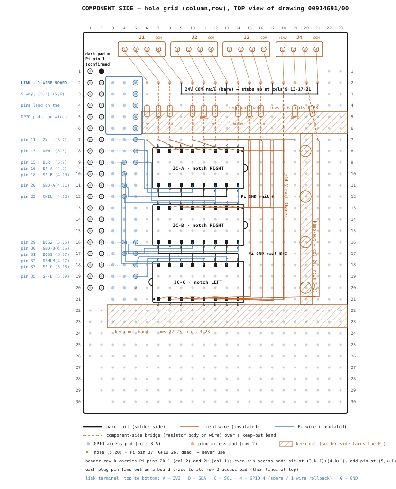
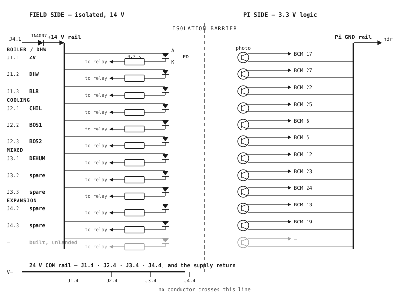

# Raspberry Pi I/O Board — Build Procedure

**Status:** Ready to build. · **Owner:** David

Build procedure for the relay-monitoring input board on the Phoenix Contact **RPI-BC INT-PCB
SET** (Mouser 651-2202994). The board watches eleven relay contacts in the control panel and
reports each one to a Pi input pin, with no copper path between the panel wiring and the Pi.
Design reasoning is in Appendix A; the 1-wire bus and DS2482 are in
`docs/ds18b20-bus-topology.md`.

Every placement in this document names an exact hole. Read §1 first — it defines the grid and
the four letters used for the chip legs.

---

## 1. How to read this document

**Holes are named `(column,row)`.** Hold the board component side up, Pi header columns on the
left, plug footprints away from you — the "TOP" view of Phoenix drawing 00914691/00 (in
`~/OneDrive - DGLC/Claude/HVAC Manuals/phoenix contact pcb.pdf`). Columns run 1–23 left to
right; rows run 1–30 top to bottom. Hole (1,1) is the top-left header pad. The figure in §5
shows the whole grid with these numbers on its edges.

**Two faces.** The *component side* is the face you look at in the TOP view; the chips,
sockets and resistor bodies go there. The *solder side* is the back; all rails and wires go
there. The board mounts with the solder side facing the Pi, which is why the keep-out areas
(§4.4) apply to the solder side.

**Four letters for the chip legs.** Each optocoupler channel is an LED facing a light-operated
switch inside one package. The letters used throughout:

| Letter | Leg | Plain meaning |
|---|---|---|
| **A** | LED + leg (anode) | current flows in here |
| **K** | LED − leg (cathode) | current flows out here, on to the plug |
| **C** | switch leg to the Pi pin (collector) | pulled low when the LED is lit |
| **E** | switch leg to Pi ground (emitter) | ties to the Pi ground rail |

**Access pads.** The board's only copper traces are Phoenix's own fan-outs: every Pi header
pin and every plug pin is pre-wired to a nearby matrix hole. Those holes are the *access
pads* — you connect to a header pin or a plug pin by soldering into its access pad, never at
the pin itself. §4.2 and §4.3 give the complete maps.

**Bare vs insulated.** Rails are bare solid wire soldered at every target. Everything else is
insulated 22 AWG solid, formed flat with pliers. An insulated wire may cross a bare rail or
pass over a pad it doesn't connect to; bare wire must never cross anything.

## 2. What the finished board is

One channel, eleven times (a twelfth is built but has no plug position behind it):

```
 panel side (no connection to the Pi)   ‖    Pi side
                                        ‖
 +14 V ──────────────► A ▷|── K ──[4.7 kΩ]──► plug pin ──► relay contact ──► COM
                        LED             ‖
                                        ‖   Pi pin ◄── C ─╲  light-operated
                                        ‖   Pi GND ◄── E ─╱  switch
```

Relay closes → current flows through the LED and resistor → the switch conducts → the Pi pin
reads LOW. `pivac/GPIO.py` already reports LOW as active under `pullmode: "pullup"`, so no
config or InfluxDB change is needed. The Pi side needs no parts at all: the internal pull-up
sets the idle level, and the chip does the rest.

The 14 V comes from a 12 V wall wart (measuring 14.7 V) through a protection diode, entering
on plug J4 position 1. Each plug's position 4 is the shared return (**24V COM — never call it
GND**; it must not touch Pi ground, or the whole point of the board is lost).

### 2.1 Channel master map

This table is the whole board. Every other table expands one of its columns.

| # | Name | IC·ch | Plug pos | Plug pad | Resistor holes | K pin at | C pin at | GPIO pad | Pi pin | BCM |
|---|------|-------|----------|----------|----------------|----------|----------|----------|--------|-----|
| 1 | `ZV` | A·4 | J1.1 | (6,2) | (6,2)→(6,7) | (7,8) | (8,11) | (5,7) | 11 | 17 |
| 2 | `DHW` | A·3 | J1.2 | (7,2) | (7,2)→(7,7) | (9,8) | (10,11) | (5,8) | 13 | 27 |
| 3 | `BLR` | A·2 | J1.3 | (8,2) | (8,2)→(8,7) | (11,8) | (12,11) | (5,9) | 15 | 22 |
| 4 | `CHIL` | A·1 | J2.1 | (10,2) | (10,2)→(10,7) | (13,8) | (14,11) | (4,12) | 22 | 25 |
| 5 | `BOS1` | B·3 | J2.2 | (11,2) | (11,2)→(11,7) | (9,13) | (10,16) | (5,17) | 31 | 6 |
| 6 | `BOS2` | B·2 | J2.3 | (12,2) | (12,2)→(12,7) | (11,13) | (12,16) | (5,16) | 29 | 5 |
| 7 | `DEHUM` | B·1 | J3.1 | (14,2) | (14,2)→(14,7) | (13,13) | (14,16) | (4,17) | 32 | 12 |
| 8 | spare SP-A | C·1 | J3.2 | (15,2) | (15,2)→(15,7) | (8,21) | (7,18) | (4,9) | 16 | 23 |
| 9 | spare SP-B | C·2 | J3.3 | (16,2) | (16,2)→(16,7) | (10,21) | (9,18) | (4,10) | 18 | 24 |
| 10 | spare SP-C | C·4 | J4.2 | (19,2) | (19,2)→(19,7) | (14,21) | (13,18) | (5,18) | 33 | 13 |
| 11 | spare SP-D | C·3 | J4.3 | (20,2) | (20,2)→(21,7) | (12,21) | (11,18) | (5,19) | 35 | 19 |
| 12 | dark (no plug) | B·4 | — | — | — | (7,13) | (8,16) | — | — | — |

The seven in-service channels keep their existing BCM pins, so no field wiring moves and no
InfluxDB history is orphaned. SP-D's resistor runs diagonally to (21,7) because column 20 rows
5–23 is a keep-out (§4.4).

## 3. Parts and tools

| Item | Part | Qty |
|---|---|---|
| Optocoupler | LTV-847 (or PC847), DIP-16 | 3 |
| IC socket | DIP-16 | 3 |
| LED resistor | 4.7 kΩ, 1/4 W, 1% metal film | 11 (+1 spare) |
| Rail / stub wire | bare 22 AWG solid copper | ~1 m |
| Hook-up wire | insulated 22 AWG solid | ~2 m |
| Supply | 12 V DC wall wart (measures 14.7 V; load is only ~35 mA) | 1 |
| Protection diode | 1N4007, mounted in the barrel-adapter screw terminal, not on the board | 1 |
| Plugs | 4-position PTSM plugs, shipped with the INT-PCB SET | 4 |

Tools: soldering iron, solder, flush cutters, small pliers, multimeter with continuity and
diode modes, calipers. A phone camera doubles as an infrared-LED detector in step 8.

Field wire for new runs is 22 AWG (PTSM terminals take 24–20 AWG); ferrules on stranded
conductors only.

## 4. The board's fixed features

### 4.1 The grid

23 columns × 30 rows of plated ⌀1.0 mm holes on a 2.54 mm pitch, all isolated — there are no
bus strips, so every rail must be built. Holes exist everywhere except: columns 1–2 rows 1–20
are the Pi header footprint; row 1 exists only at columns 1–2 and 22–23; and the bottom-left
corner steps in (columns 1–2 exist from row 22 down, column 1 ending near row 26).

### 4.2 Pi header fan-out — the GPIO access pads

The header is 2 columns × 20 rows. Its top-right pad (2,1) is marked as position 1 and is
expected to be **Pi pin 1** — step 1 verifies this before anything is soldered. Header row *k*
then carries Pi pins 2k−1 (column 2) and 2k (column 1), and Phoenix's traces give every pin
its access pads **one row below its own row**:

- **odd pin 2k−1** → one access pad at **(5, k+1)**
- **even pin 2k** → two access pads, **(3, k+1)** and **(4, k+1)** (electrically the same —
  use either)

The full map, with this board's use of each pin:

| Row k | Pi pin (col 2) | Use | Access pad | Pi pin (col 1) | Use | Access pads |
|---|---|---|---|---|---|---|
| 1 | 1 · 3V3 | reserved | (5,2) | 2 · 5V | — | (3,2) (4,2) |
| 2 | 3 · GPIO2 | I²C, reserved | (5,3) | 4 · 5V | — | (3,3) (4,3) |
| 3 | 5 · GPIO3 | I²C, reserved | (5,4) | 6 · GND | verify | (3,4) (4,4) |
| 4 | 7 · GPIO4 | reserved (1-wire rollback) | (5,5) | 8 · GPIO14 | serial console — leave | (3,5) (4,5) |
| 5 | 9 · GND | verify | (5,6) | 10 · GPIO15 | serial console — leave | (3,6) (4,6) |
| 6 | 11 · GPIO17 | **ZV** | **(5,7)** | 12 · GPIO18 | unused | (3,7) (4,7) |
| 7 | 13 · GPIO27 | **DHW** | **(5,8)** | 14 · GND | verify | (3,8) (4,8) |
| 8 | 15 · GPIO22 | **BLR** | **(5,9)** | 16 · GPIO23 | **SP-A** | (3,9) **(4,9)** |
| 9 | 17 · 3V3 | — | (5,10) | 18 · GPIO24 | **SP-B** | (3,10) **(4,10)** |
| 10 | 19 · GPIO10 | SPI block — leave | (5,11) | 20 · GND | **rail A jumper** | (3,11) **(4,11)** |
| 11 | 21 · GPIO9 | SPI block — leave | (5,12) | 22 · GPIO25 | **CHIL** | (3,12) **(4,12)** |
| 12 | 23 · GPIO11 | SPI block — leave | (5,13) | 24 · GPIO8 | SPI block — leave | (3,13) (4,13) |
| 13 | 25 · GND | verify | (5,14) | 26 · GPIO7 | SPI block — leave | (3,14) (4,14) |
| 14 | 27 · GPIO0 | ID EEPROM — leave | (5,15) | 28 · GPIO1 | ID EEPROM — leave | (3,15) (4,15) |
| 15 | 29 · GPIO5 | **BOS2** | **(5,16)** | 30 · GND | **rail B·C jumper** | (3,16) **(4,16)** |
| 16 | 31 · GPIO6 | **BOS1** | **(5,17)** | 32 · GPIO12 | **DEHUM** | (3,17) **(4,17)** |
| 17 | 33 · GPIO13 | **SP-C** | **(5,18)** | 34 · GND | verify | (3,18) (4,18) |
| 18 | 35 · GPIO19 | **SP-D** | **(5,19)** | 36 · GPIO16 | free | (3,19) (4,19) |
| 19 | 37 · GPIO26 | **DEAD — never use** | (5,20) | 38 · GPIO20 | free | (3,20) (4,20) |
| 20 | 39 · GND | verify | (5,21) | 40 · GPIO21 | free | (3,21) (4,21) |

This map is derived from the customer drawing, which is marked *simplified representation* —
step 1 verifies it with a meter before it is trusted.

### 4.3 Plug fan-out — the field access pads

The four PTSM footprints sit above row 1. Numbering the sixteen positions 1–16 left to right,
**position n's access pad is (n+5, 2)** — all sixteen in row 2, columns 6–21. Plugs and
positions, left to right:

| Plug | Positions (left→right) | Access pads | Assignment |
|---|---|---|---|
| **J1** — boiler / DHW | 1 2 3 4 | (6,2) (7,2) (8,2) (9,2) | `ZV` · `DHW` · `BLR` · **COM** |
| **J2** — cooling | 1 2 3 4 | (10,2) (11,2) (12,2) (13,2) | `CHIL` · `BOS1` · `BOS2` · **COM** |
| **J3** — mixed | 1 2 3 4 | (14,2) (15,2) (16,2) (17,2) | `DEHUM` · spare · spare · **COM** |
| **J4** — power + expansion | 1 2 3 4 | (18,2) (19,2) (20,2) (21,2) | **+14V in** · spare · spare · **COM** (also the supply return) |

Position numbers here are board positions counted left to right in the TOP view. When wiring a
plug, match by position on the footprint, not by any number printed on the plug body.

J2 groups the three cooling sources so a cooling question is answered from one connector.
Keep the +14 V position at the end of J4, label it on board and plug, and land its field
conductor last — it is the one live position among dry contacts.

### 4.4 Keep-out areas (solder side)

The solder side faces the Pi, and the cross-hatched areas in the drawing are where the Pi and
housing come close. No solder-side wire, rail, joint or pin tail may sit in them:

| Area | Holes covered |
|---|---|
| Upper band | rows 5–6, columns 6–23 |
| Lower band | rows 22–23, columns 3–23 |
| Vertical strip | column 20, rows 5–23, with round bulges reaching toward columns 19 and 21 near rows 8, 12, 16 and 20 |

The gaps matter as much as the bands: columns 1–5 cross the upper band freely, columns 1–2
cross the lower band freely, and rows 1–4 and 24–30 are clear across the full width. The
**component side is not restricted** — that is what lets the resistors bridge the upper band
(§5.2). Step 2's dry-fit confirms the cover clears the component side.

### 4.5 Free holes

After this build: row 1 columns 22–23; rows 3–4 columns 6–23 (except rail stubs); columns
22–23 rows 2–21; and everything below row 23 (columns 3+ only in rows 22–23). The area below
the lower band is the natural home for a future addition; reach it through columns 1–2.

## 5. Placement map



*(Figure source: `docs/rpi-io-board-layout.gen.py` — regenerate with `python3` after edits.)*

### 5.1 IC sockets

All three sockets sit at columns 7–14. IC-A and IC-B point their notch **right**; IC-C points
its notch **left** — deliberately rotated so its C/E row faces the shared ground rail on row
17 instead of the keep-out band below it. Mark IC-C's orientation on the board before
soldering; a chip inserted the standard way round there is the likeliest assembly mistake on
the board.

| Socket | Pin rows | Notch | LED row (A/K) | Switch row (C/E) |
|---|---|---|---|---|
| IC-A | 8 and 11 | right (col 14) | row 8 | row 11 |
| IC-B | 13 and 16 | right (col 14) | row 13 | row 16 |
| IC-C | 18 and 21 | left (col 7) | row **21** | row **18** |

Hole-by-hole, IC-A and IC-B (IC-B in brackets):

| Column | 7 | 8 | 9 | 10 | 11 | 12 | 13 | 14 |
|---|---|---|---|---|---|---|---|---|
| Row 8 (13) | K·ch4 | A·ch4 | K·ch3 | A·ch3 | K·ch2 | A·ch2 | K·ch1 | A·ch1 (pin 1) |
| Row 11 (16) | E·ch4 | C·ch4 | E·ch3 | C·ch3 | E·ch2 | C·ch2 | E·ch1 | C·ch1 |

IC-C:

| Column | 7 | 8 | 9 | 10 | 11 | 12 | 13 | 14 |
|---|---|---|---|---|---|---|---|---|
| Row 18 | C·ch1 | E·ch1 | C·ch2 | E·ch2 | C·ch3 | E·ch3 | C·ch4 | E·ch4 |
| Row 21 | A·ch1 (pin 1) | K·ch1 | A·ch2 | K·ch2 | A·ch3 | K·ch3 | A·ch4 | K·ch4 |

### 5.2 Resistors

Each resistor is the connection from its channel's plug pad to its channel's LED. The body
lies on the **component side**, bridging the upper keep-out band; the top lead drops into the
plug access pad at row 2, the bottom lead into the free hole at row 7 listed in §2.1. Ten are
straight vertical spans of 5 holes (12.7 mm); SP-D's runs one column diagonal, (20,2)→(21,7),
to keep its bottom joint out of the column-20 strip. Form the leads so the body sits flat over
rows 3–6.

### 5.3 Rails

Four rails, all bare 22 AWG solid on the solder side, ends bent into the named holes and the
middle soldered at each stub or crossing:

| Rail | Runs | Stubs (bare, one hole long) |
|---|---|---|
| **24V COM** | row 3, (9,3)→(21,3) | down into (9,2), (13,2), (17,2), (21,2) — the four COM plug pads |
| **Pi GND A** | row 12, (7,12)→(13,12) | up onto the E rings at (7,11), (9,11), (11,11), (13,11) |
| **Pi GND B·C** | row 17, (7,17)→(14,17) | up onto (7,16), (9,16), (11,16), (13,16); down onto (8,18), (10,18), (12,18), (14,18) |
| **+14 V** | column 18, (18,7)→(18,21) | none — the three feeders below tap it |

The +14 V rail is fed by a **component-side insulated bridge** from the J4.1 plug pad:
(18,2)→(18,7), crossing the upper band on the top face exactly as the resistors do. Both the
bridge (from the top) and the rail's end (on the ring, from below) solder at (18,7).

Three insulated **feeders** carry +14 V from the rail to each chip's first A pin, and short
insulated **hops** pass it along the LED row, jumping over each K pin:

| Chip | Feeder | Hops (ring to ring) |
|---|---|---|
| IC-A | rail at (18,8) → ring (14,8) | (14,8)→(12,8) → (10,8) → (8,8) |
| IC-B | rail at (18,13) → ring (14,13) | (14,13)→(12,13) → (10,13) → (8,13) |
| IC-C | rail at (18,21) → ring (13,21), passing over (14,21) | (13,21)→(11,21) → (9,21) → (7,21) |

Two insulated **ground jumpers** tie the ground rails to the Pi: rail A's left end
(7,12) → hole (4,11) (Pi pin 20), and rail B·C's left end (7,17) → hole (4,16) (Pi pin 30).
Both pass over the column-5 pads without touching them.

### 5.4 Wires

Every wire is insulated 22 AWG unless marked bare. "Ring" means the wire ends on the copper
ring around an occupied socket-pin hole (see §6 rules); a bare `(c,r)` destination is an empty
hole the wire end drops into. Streets are the free columns the long runs travel in: columns
15, 16, 17 to the right of the chips for field wires, columns 3–6 to the left for Pi wires.

**Field wires** (K pin → resistor bottom):

| Ch | From | Route | To ring |
|---|---|---|---|
| ZV | (6,7) | short diagonal | (7,8) |
| DHW | (7,7) | over (8,8) | (9,8) |
| BLR | (8,7) | along row 7/8 | (11,8) |
| CHIL | (10,7) | along row 7/8 | (13,8) |
| DEHUM | (14,7) | row 7 → down col 15 → in along row 13 | (13,13) |
| BOS2 | (12,7) | row 7 → down col 16 → in along row 13 | (11,13) |
| BOS1 | (11,7) | row 7 → down col 17 → in along row 13 | (9,13) |
| SP-A | (15,7) | down col 15 (beside DEHUM's) → in along row 21 | (8,21) |
| SP-B | (16,7) | down col 16 (beside BOS2's) → in along row 21 | (10,21) |
| SP-C | (19,7) | row 7 → down col 17 (beside BOS1's) → in along row 21 | (14,21) |
| SP-D | (21,7) | down col 21, pressed flat past the bulge rows 8·12·16·20 → in along row 21 | (12,21) |

The "in along row 13 / row 21" segments pass over that chip's own LED-row pins — same side of
the isolation gap, so this is allowed; keep the insulation intact over each pin it crosses.

**Pi wires** (C pin → GPIO access pad):

| Ch | From ring | Route | To hole |
|---|---|---|---|
| ZV | (8,11) | left between rows 11/12 → up col 6 | (5,7) |
| DHW | (10,11) | left between rows 11/12 → up col 6 | (5,8) |
| BLR | (12,11) | cross rail A → left between rows 12/13 → up col 6 | (5,9) |
| CHIL | (14,11) | cross rail A → left between rows 12/13 | (4,12) |
| BOS2 | (12,16) | left between rows 16/17 | (5,16) |
| BOS1 | (10,16) | left between rows 16/17 → down one row | (5,17) |
| DEHUM | (14,16) | left between rows 16/17 → down one row | (4,17) |
| SP-A | (7,18) | up over rail B·C → up col 4, over the pads | (4,9) |
| SP-B | (9,18) | up over rail B·C → up col 4, beside SP-A's | (4,10) |
| SP-C | (13,18) | up over rail B·C → left | (5,18) |
| SP-D | (11,18) | up over rail B·C → left via col 6 → down one row | (5,19) |

Pi wires stay left of the chips and may run over the column 3–5 pads (same side of the gap).
Field wires stay right of the chips and must never enter columns 1–6. Where a wire crosses a
bare rail it crosses at a right angle, pressed flat, insulation intact.

## 6. Build sequence

Each step verifies the one before it. Three joint rules apply throughout:

- **A wire or lead never shares a hole with a socket pin.** The hole is ⌀1.0 mm and both
  conductors are ~0.6 mm. Solder the pin normally; then lay the tinned wire end flat on the
  copper ring around that hole, against the pin's joint, and reflow so one joint wets both.
- **Never wrap wire around a pin** or tack it to a pin's side — both fail with time and block
  chip seating. If a ring is awkward, drop the wire into the adjacent free hole and bridge the
  2.54 mm to the ring with a scrap of bare wire.
- **Lowest parts first** within each soldering step, so the board lies flat when flipped.

### Step 0 — identify the chip's legs with the meter

Do this even though §5.1 says what to expect; a wrong assumption here costs four channels per
package. Meter in **diode mode** on one loose LTV-847: an LED pair reads about 1.1 V one way
and open reversed (red lead is on A); a switch pair (C/E) reads open both ways. Expected, pin
1 at the notch: channels 1–4 have A/K on pins 1/2, 3/4, 5/6, 7/8 and E/C on pins 15/16, 13/14,
11/12, 9/10. Write down what the meter says and use that.

### Step 1 — verify the board's maps

All with the continuity meter, nothing soldered yet:

1. **Isolated matrix:** two adjacent free holes must NOT beep. Confirms there are no hidden
   bus strips (the drawing is a simplified representation).
2. **Position 1:** find the marked pad on the header footprint — expect square/marked at
   (2,1).
3. **Header fan-out spot checks:** (2,1)↔(5,2) beeps; (1,1)↔(3,2) and (1,1)↔(4,2) beep;
   (2,20)↔(5,21) beeps; a deliberate wrong pair, e.g. (2,1)↔(5,3), stays silent. That confirms
   the §4.2 rule at both ends of the header.
4. **Plug fan-out spot checks:** leftmost plug position ↔ (6,2); rightmost ↔ (21,2).
5. **Pi pin identity — the ground pattern.** Mate the board with the powered-off Pi (or hold
   it aligned) and check continuity from the Pi's ground (a USB shell works) to each of:
   (3,4), (5,6), (3,8), (3,11), (5,14), (3,16), (3,18), (5,21). All eight beep and no
   neighbouring pad does — that spacing is unique to the ground pins, so it proves position 1,
   the numbering direction and the row order in one pass. **If any of the eight misses, stop:
   the header map is mirrored. Re-derive §4.2 from the pattern the meter shows before touching
   a soldering iron.**

### Step 2 — dry-fit, cover on

Place the three sockets, a resistor bent to span rows 2→7, and the board in the housing with
the Pi and the cover. Check three clearances:

- Component-side height over the keep-out rows (resistor bodies, socket + chip) against the
  housing cover.
- The plug bases: they must not cover the row-2 access pads. If a base overhangs row 2, land
  every resistor top lead at row 3 instead, move the COM rail to row 4, and connect each row-3
  hole to its row-2 pad with a short bare link before the plugs go on.
- The solder side against the Pi: nothing may protrude into the §4.4 areas. Trim all
  solder-side joints there flush.

### Step 3 — solder the sockets

Orientation per §5.1 — **IC-C notch left**. For each socket: solder two diagonal corner pins,
check it sits flat, then the remaining fourteen. Leave the chips out until step 8.

### Step 4 — rails, stubs and jumpers

Solder the four rails, their stubs and the two ground jumpers per §5.3. Bare rail ends bend
into their end holes; stubs are short bare offcuts. Then meter: COM rail ↔ each of the four
COM plug positions beeps; ground rail A ↔ Pi pin 20's pad (4,11) beeps; rail B·C ↔ (4,16)
beeps; **+14 V rail ↔ any ground rail stays silent, and every rail ↔ every other rail stays
silent.**

### Step 5 — resistors and the +14 V bridge

Eleven resistors per §2.1, bodies flat on the component side over rows 3–6; then the insulated
bridge (18,2)→(18,7). Meter: each plug channel position ↔ its row-7 hole reads ~4.7 kΩ; J4
position 1 ↔ the +14 V rail beeps.

### Step 6 — wires

Feeders, hops, field wires, Pi wires per §5.3–5.4, in that order (shortest reach first). Keep
the two wire families on their own sides of the chips; that separation is the isolation gap,
and no care inside the chip survives a wire that bridges around it.

### Step 7 — electrical check before any chip is fitted

With no ICs there is no current path, so this is safe and diagnostic:

1. Unpowered: from each channel's K-pin ring to its plug position, ~4.7 kΩ (proves resistor +
   field link). From each A-pin ring to the +14 V rail, a beep (proves feeder + hops). From
   each E-pin ring to its ground rail, a beep. From each C-pin ring to its GPIO access pad, a
   beep.
2. Power the wall wart into J4 (position 1 +, position 4 −, diode in the barrel adapter):
   every A-pin pad reads **≈ +14 V relative to COM**. 0 V means a broken feeder or hop;
   negative means the supply is reversed and the diode has done its job. Power down.

### Step 8 — chips in, channel-by-channel test

Fit the three chips (IC-C rotated!). Board on the bench, powered, connected to the Pi. For
each channel, short its plug position to COM at the plug — that is a closed relay:

- The LED is infrared; a **phone camera** shows it glowing through the package gap — proves
  the field side.
- `raspi-gpio get <bcm>` reports `level=0` — proves the whole channel.

A channel that lights but doesn't pull the pin low has a seating/orientation problem; one that
does neither is on the field side. Test the dark channel B·4 with clip leads: +14 V through
the spare resistor to its A ring (8,13), K ring (7,13) to COM, then meter resistance C to E at
(8,16)/(7,16) — low while lit.

### Step 9 — solder-bridge sweep, then field wiring

Meter every adjacent pin pair on each socket and neighbouring resistor joints — a bridge on
the LED row makes two channels move together later. Then mount, and wire the panel: one
conductor per channel to that relay's normally-open contact, one common daisy-chained along
each group returning to that plug's position 4. Ferrules on stranded wire, strain relief at
the housing entry, every channel labelled with the name it publishes under
(`docs/PhoenixContact-BC-RPI-label.docx`). Land **+14 V on J4 position 1 last**, label
checked on board and plug.

Two field faults to know: a channel conductor shorted to COM reads permanently *active* (safe
direction, but label for it); a channel conductor shorted to chassis or Pi ground does nothing
at all — which is the point of the board.

---

## Appendix A — design decisions

**Why optocouplers.** GPIO 26 died in the 2026-06-23 power event — shorted to ground, beyond
even output drive. A resistor network would limit a repeat to ~24 mA into the pin; the
optocoupler removes the copper path entirely, so no field fault can reach the Pi at all. The
service history shows the old direct wiring's tiny contact current (66 µA) read reliably for a
year, so contact wetting was never the argument — isolation is.

**Why the resistor sits between K and the plug.** The same series loop can order its parts
either way; current and function are identical. Putting the resistor on the K side lets its
body be the band crossing: the upper keep-out separates the plug pads (row 2) from the chips
(rows 7+) on the solder side, and the component side is the only legal path across. Eleven
resistor bodies do the crossing with zero extra wires. (The schematic below draws the resistor
on the +V side; same circuit, different physical order.)



**Why IC-C is rotated.** A ground rail must sit one row off its chip's C/E row (the pins
alternate C E C E, so a rail on the pin row itself would short every switch). IC-C's C/E row
would want its rail on row 22 — inside the lower keep-out. Rotating IC-C puts its C/E row on
row 18, sharing row 17's rail with IC-B, whose stubs interleave (odd columns up to IC-B, even
columns down to IC-C).

**Why 14 V and 4.7 kΩ.** The LED needs a few mA from any isolated DC source. The 12 V wart
measures 14.7 V lightly loaded → 2.9 mA per channel, gentle on LED ageing, 15× margin over
what the Pi pin needs. 4.7 kΩ also spans the future upgrade — rectifying the panel's own
24 VAC (measured 25.9 VAC → ~35 V DC) gives 7.2 mA on the same value; swap the twelve
resistors to 1/2 W, add a DB107 bridge and a 100 µF/50 V capacitor at the board input, and
nothing else changes. Leave board space near J4 for them (rows 3–4, columns 19–23 are free).
Do not feed the LEDs raw AC: they fail on the reverse half-cycle, and per-channel AC parts
flicker at line frequency, which the poll would sample as random inactive reads.

**Why four separate commons.** Pin 4 on every plug, tied together only on the board (COM
rail): unplugging one group's plug takes down only that group, and a bad crimp on one common
shows as three channels failing together instead of eleven misbehaving at once. A single
shared common would buy three more channels at the cost of both properties; four spares
already cover the known expansion (leak-pan restore, master-bedroom Y2).

**Supply failure mode.** The sense loop shares nothing with the panel's 24 VAC, so a control
transformer failure reads as all channels inactive — same as idle. Loop temperatures, `CHIL`
silence on a hot day and the boiler alerts already cover that gap. Moving to the rectified
24 VAC supply would tie the two failures together; the freshness alerts don't change either
way.

**Reserved pins.** GPIO 2/3 (pads (5,3), (5,4)) are the I²C for the DS2482 1-wire bridge,
which lives beside the 1-wire terminals on the extension board — see
`docs/ds18b20-bus-topology.md` §7. GPIO 4 stays unassigned until the bridge has survived a
heating season, so `w1-gpio` rollback stays possible. GPIO 14/15 stay a serial console — the
recovery path on a headless DIN-mounted Pi. BCM 7–11 stay a contiguous SPI block for a future
ADC or display. Vestigial cleanup that lands with the DS2482: `pivac/GPIO.py:17`'s
`os.system('modprobe w1-gpio')`.

**Relay wiring stays off the extension board.** The adjacent housing carries the 1-wire bus —
a slow line with no noise rejection that has already collapsed once. Switched 24 V field
wiring bundled with it invites exactly that pickup; isolation protects the Pi, not the
neighbouring cable. If channels beyond eleven are ever needed, put them at the far end of the
extension board and bring their field wiring through a separate entry.
