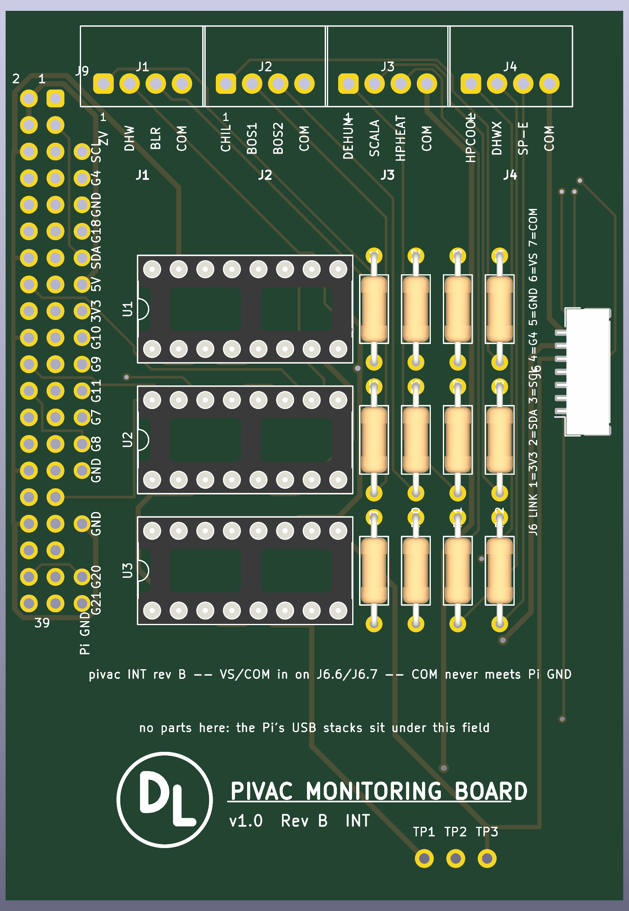
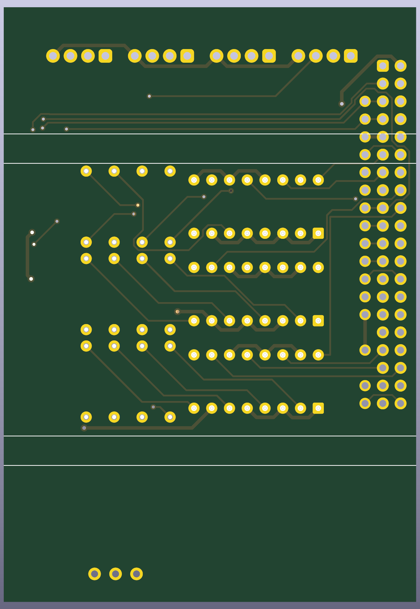
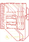
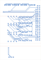
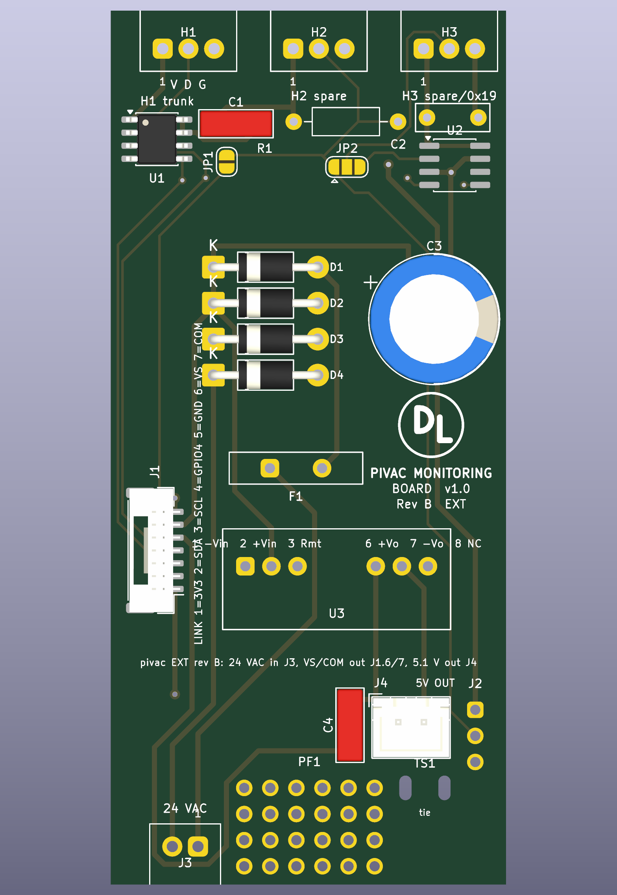
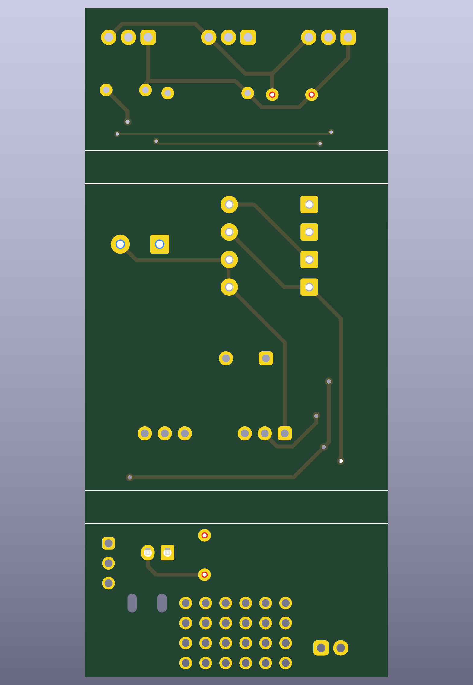
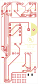
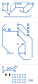

# Raspberry Pi I/O boards, rev B — review before the OSH Park order

The rev B boards as generated by the scripts in `hardware/` (`build.sh` runs the chain). Both boards route completely, pass DRC with no violations and no unconnected items, and their schematics carry the same nets. Gerbers and drill files are exported and zipped per board. The design is `rpi-io-boards-revb-plan.md`, with every part's size, position and purpose in its component indexes; this file is the checklist for the order.

| | INT board | EXT board |
|---|---|---|
| Size | 59 × 85 mm, 7.8 in² | 38.5 × 85 mm, 5.1 in² |
| DRC, error severity | 0 violations, 0 unconnected | 0 violations, 0 unconnected |
| Footprints | 25 | 24 |
| Gerbers | `hardware/int-board/int-board-gerbers.zip` | `hardware/ext-board/ext-board-gerbers.zip` |
| BOM | `hardware/int-board/int-board-bom.csv` | `hardware/ext-board/ext-board-bom.csv` |
| Renders | `hardware/int-board/int-board-{top,bottom}.png` | `hardware/ext-board/ext-board-{top,bottom}.png` |
| Copper plots | `hardware/int-board/int-board-copper-{front,back}.svg` | `hardware/ext-board/ext-board-copper-{front,back}.svg` |
| Schematic drawing | `hardware/int-board/int-board-schematic.svg` | `hardware/ext-board/ext-board-schematic.svg` |

## INT board: relay inputs, Pi header, link

The copper plots are the view to check traces on: front copper with the front silkscreen, and back copper mirrored, so both read as if looking at that face of the board.

Twelve sense inputs on J1 to J4 through three LTV-847 optocouplers with 12 kΩ series resistors (2.8 mA at about 35 V); the sense rail VS and its return COM arrive from the EXT board on pins 6 and 7 of the 7-way GH link J6, which sits inside the housing's slot on the right edge with its entry facing the slot and pin 1 at the bottom; a shadow column J9 breaks out the free header pins; the test points sit at the bottom right and the title block is centred in the bottom field. The power section of rev A (bridge, PTC, reservoir, J7) has moved to EXT, and J8 has gone because J4 now carries HPCOOL, DHWX and SP-E. The bottom field is otherwise empty on purpose: it lies over the Pi's USB stacks, where a pin tail meets a USB shell. COM is the sense return and is never Pi ground. Header pins 2 and 4 carry nothing: the Pi is fed through its own USB-C. Pins 1, 9, 25 and 39 stay open on the board; the Pi ties each to its twin.

**Height.** The component side faces the cover, about 8 mm proven on the rev A board for a DIP socket with its chip. Nothing fitted stands taller: the PTSM headers are 7.5 mm, the GH header 4.35 mm mated, the resistors lie flat.

**Hand-laid tracks.** Three connections are fixed tracks that Freerouting works around, because it left them open or crossed them on most runs: GPIO6 from header pin 31 along the pad-free row 16 of the shadow column to U2 pin 16, on the front copper; GPIO24 from pin 18, escaping between pins 17 and 19 and crossing the shadow column between rows 9 and 10, to U3 pin 16, on the back copper; and GND from J6 pin 5 down the strip inside the right edge to TP3. The GND bus along the header's outer column and the GPIO8 route are rev A's.

### What each reference is

| Ref | Part | Purpose |
|---|---|---|
| J1–J4 | PTSM 0,5/4 plugs, top edge, faces 1.55 mm inside the edge | Field wiring. J1: ZV, DHW, BLR, COM. J2: CHIL, BOS1, BOS2, COM. J3: DEHUM, SCALA, HPHEAT, COM. J4: HPCOOL, DHWX, SP-E, COM. |
| J5 | 2 × 20 socket, solder side | The Pi's GPIO header. |
| J6 | JST GH SM07B-GHS-TB, right edge, in the slot | Link to the EXT board: 3V3, SDA, SCL, GPIO4, GND, VS, COM, pin 1 at the bottom. |
| J9 | shadow column beside the header | One labelled pad per free header pin (SCL, GPIO4, GND, GPIO18, SDA, 5V, 3V3, GPIO10, 9, 11, 7, 8, GND, GND, GPIO20, GPIO21). Covered once the Pi is on the header; for bench soldering only. |
| U1–U3 | LTV-847 in DIP-16 sockets, x 13 | Four optocoupler channels each: U1 for J1's three and CHIL, U2 for BOS1, BOS2, DEHUM, SCALA, U3 for HPHEAT, HPCOOL, DHWX, SP-E. |
| R1–R12 | 12 kΩ 1/4 W, columns at 4.0 mm | LED series resistor for each channel; R1–R4 beside U1, R5–R8 beside U2, R9–R12 beside U3, each bank level with its optocoupler. |
| TP1–TP3 | test pads | VS, COM and Pi GND for a meter. |

**Fitted parts:** J1–J4 PTSM 0,5/4-HH-2,5-THR; J5 2 × 20 socket on the solder side; J6 JST SM07B-GHS-TB; R1–R12 12 kΩ 1/4 W; U1–U3 LTV-847 in DIP-16 sockets. Nothing is placed unfitted.

## EXT board: 1-wire master, probe headers, sense supply, the Pi's supply

The probe end is rev A's: the trunk header H1 (VCC · DATA · GND) and the spare headers H2 and H3 at the top edge with their faces 1.7 mm outside it, the DS2482-100 at 0x18 with its 100 nF, the second DS2482 at 0x19 (U2, not fitted) selectable for H3 by the solder jumper JP2, and the rollback jumper JP1 with its 2.2 kΩ pull-up (not fitted), now in one row between the sockets and the upper rib. The mid field carries the power section: 24 VAC from J3 at the bottom edge through the standing PTC F1 into the D1–D4 bridge and the standing 470 µF C3, VS and COM leaving on pins 6 and 7 of the 7-way GH link J1 at the left edge beside the housing opening, and the isolated converter U3 along the lower rib making 5.1 V for the Pi, which leaves on J4, a 2-pin XH under the rib, into a USB-C pigtail tied down through the slot pair TS1. A 6 × 4 proto field sits between J3 and the tie slots, the bus breakout J2 at the right, and the title block in the space between C3, F1 and U3.

**Height.** The housing gives this board at least 30 mm (measured 2026-09-26): C3 stands 25 mm, F1 13 mm, U3 12 mm.

**Hand-laid tracks.** VS from C3's positive pad along y 22.9 to D1's cathode, and the tie between U2's two VCC pins, both of which Freerouting left open on most runs. The Power netclass (VS, COM, the AC nets, +5V, GND, VCC) runs at 0.5 mm clearance on this board.

### What each reference is

| Ref | Part | Purpose |
|---|---|---|
| H1 | PTSM 0,5/3, top edge | The 1-wire trunk: VCC, DATA, GND. |
| H2 | PTSM 0,5/3, top edge | Spare probe header on the same bus. |
| H3 | PTSM 0,5/3, top edge | Spare probe header, on the bus or on U2 by JP2. |
| U1 | DS2482-100 at 0x18 | The I²C 1-wire master that drives the bus. |
| U2 | DS2482-100 at 0x19, not fitted | A second master for a second bus on H3. |
| C1, C2 | 100 nF | Supply decoupling for U1 and U2 (C2 not fitted). |
| JP1 | solder jumper | Joins GPIO4 to DATA to run the bus from the Pi's own 1-wire again. |
| JP2 | three-way solder jumper | Puts H3 on the bus or on U2. |
| R1 | 2.2 kΩ, not fitted | DATA pull-up for the GPIO4 rollback; the DS2482 supplies its own. |
| J1 | JST GH BM07B-GHS-TBT, left edge, top entry | Link from the INT board: 3V3, SDA, SCL, GPIO4, GND, VS, COM, pin 1 at the bottom. Keep x 0–9.5, y 41–61 clear of tall parts for its plug. |
| J3 | PTSM 0,5/2, bottom edge, face 1.7 mm outside it | 24 VAC in: pin 1 hot, pin 2 common. White plug, so it is never taken for a probe plug. |
| F1 | PTC 1.1 A 60 V, standing | Resettable fuse in the 24 VAC feed. |
| D1–D4 | 1N4007 | Full-wave bridge to the VS rail and COM. |
| C3 | 470 µF 63 V, standing | Reservoir on the VS rail: the valley stays near 28 V at the Pi's peak draw against U3's 16.4 V lockout. |
| U3 | Traco TMR 12-4811WI, SIP-8 | Isolated converter, 35 V in to 5.1 V at 2.4 A out. Pin 3 Remote open (on); pins 4 and 5 do not exist. No holes for pins 9 to 12 (case and stand-offs): clip the shanks of 9 and 12 at the shoulder, and lay polyimide tape on the board under the body, because the VS and +5V tracks on the component side pass under the shoulders of pins 11 and 10. |
| C4 | 1 µF 50 V ceramic | U3's output capacitor. |
| J4 | JST XH B2B-XH-A, 2 pins | 5.1 V out to the USB-C pigtail: pin 1 +5V, pin 2 GND. |
| TS1 | two unplated 1.2 × 2.4 mm slots | Cable tie for the pigtail: down one, across the solder side, up the other. |
| PF1 | 6 × 4 proto pads | Bodge field. |
| J2 | three pads | VCC, DATA, GND of the bus, for wires or a scope. |

**Fitted parts:** C1 100 nF; C3 470 µF 63 V; C4 1 µF; D1–D4 1N4007; F1 Littelfuse 60R110XU; H1–H3 PTSM 0,5/3-HH-2,5-THR; J1 JST BM07B-GHS-TBT; J3 PTSM 0,5/2-HH-2,5-THR; J4 JST B2B-XH-A; JP1, JP2 solder jumpers; U1 DS2482-100 SOIC-8; U3 TMR 12-4811WI. **Placed, not fitted:** C2 100 nF; R1 2.2 kΩ; U2 DS2482-100.

## Checks before ordering

1. **Both boards route and pass DRC**, 0 violations at error severity and 0 unconnected items each, on the last `build.sh` run.
2. **Every channel keeps its BCM pin** from rev A; `hardware/gen_tables.py` carries the rev B J4 row (HPCOOL 13, DHWX 19, SP-E 16). `config.yml` needs no change. The label's J4 row is still to be updated.
3. **No through-hole pad sits in a rib band.** The outer resistor pads are at y 23.4 and 58.3 inside the 22.31 to 61.29 window; the diode rows run at 3.5 mm so their courtyards clear; C3 and U3 bodies cross the lower rib line on the component side, which the ribs on the solder side do not care about.
4. **The PTSM headers meet their edges as rev A's do:** INT J1–J4 faces 1.55 mm inside the top edge, EXT H1–H3 and J3 faces 1.7 mm outside theirs. David's report that the rev A 3-way and 5-way headers sat differently against their edges is the one open item: the measured offset and direction decide whether a pin row moves before the order.
5. **The link headers face each other across the opening** with J6's entry toward the slot and J1 standing low against EXT's lower rib, pin 1 at the bottom on both, so the seven leads run straight.
6. **Heights** are inside the covers: nothing on INT over the PTSM headers' 7.5 mm; nothing on EXT over C3's 25 mm against the 30 mm available.
7. **Fit check in the KiCad 3D viewer** against the Phoenix STEP models in `hardware/vendor/` is still to do: J1's plug room, J3 and the probe plugs against the housing openings.

## The order

Bare boards from OSH Park, three of each, hand assembled: two-layer, 1.6 mm, 1 oz copper, ENIG. Ordered 2026-09-27 from the Gerber zips, with the parts from Digi-Key and Amazon the same day; the zips are also in `~/OneDrive - DGLC/Claude/` as `int-board-revB-gerbers.zip` and `ext-board-revB-gerbers.zip`.

| | Area | Price for three | Turnaround |
|---|---|---|---|
| INT | 7.8 in² | about $39 at $5/in² | 9–12 days (5 business days at $10/in²) |
| EXT | 5.1 in² | about $26 | same |

Parts per `rpi-io-boards-revb-plan.md` §7: the new parts with Digi-Key and Amazon links in §7.1, the parts carried over from the rev A order in §7.2. The rev B INT board needs four new PTSM 0,5/4 headers, since the rev A order bought five and four are on the board in service.
