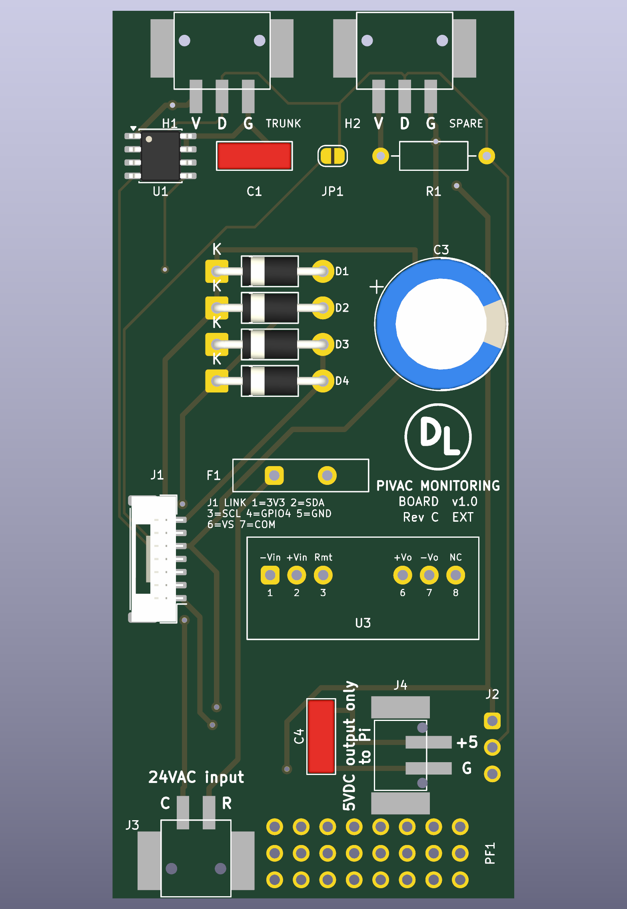
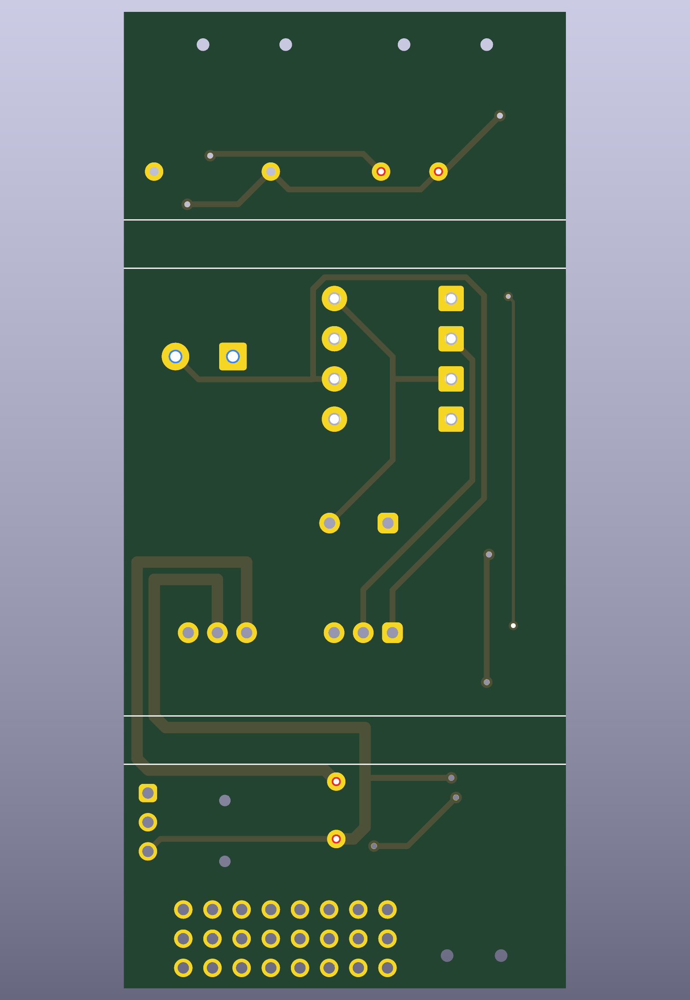
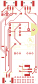
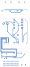

# Raspberry Pi I/O boards, rev C EXT — review before the OSH Park order

The rev C EXT board as generated by `hardware/build.sh extc`. It routes completely and passes DRC with no violation and nothing unconnected, and its schematic carries the same nets. Gerbers and drill files are exported and zipped. The design is `rpi-io-boards-revc-plan.md`; this file is the checklist for the order. The INT board stays at rev B (`rpi-io-boards-revb-review.md`).

| | EXT board, rev C |
|---|---|
| Size | 38.5 × 85 mm, 5.1 in² |
| DRC, error severity | 0 violations, 0 unconnected |
| Footprints | 19 |
| Copper | 162 track segments, 109 on the front and 53 on the back, 10 vias |
| Track widths | 1.0 mm on the Pi's supply from U3 to C4, 0.5 mm on the other power runs, 0.25 mm on the rest |
| Gerbers | `hardware/extc-board/extc-board-gerbers.zip` |
| BOM | `hardware/extc-board/extc-board-bom.csv` |
| Renders | `hardware/extc-board/extc-board-{top,bottom}.png` |
| Copper plots | `hardware/extc-board/extc-board-copper-{front,back}.svg` |
| Schematic drawing | `hardware/extc-board/extc-board-schematic.svg` |

The same files are in `~/OneDrive - DGLC/Claude/` as `ext-board-revC-*`.

## The board

The renders show the surface-mount headers as bare pads, because the footprints carry no 3D model. The copper plots are the view to check traces on: front copper with the front silkscreen, and back copper mirrored, so both read as if looking at that face of the board.

Two probe sockets on the top edge and the 24 VAC input on the bottom edge are surface-mount PTSM headers with the entry face on the board edge. The 5 V output is the vertical header of the same family, turned so its leads point at the right edge. The power section and the link are rev B's, with U3 2 mm further from J1. The solder side carries no connector pin: the four PTSM headers leave only their eight peg holes there.

**Height.** The housing gives EXT 30 mm. C3 stands 25 mm, a plug seated in J4 18.4 mm, U3 12 mm.

### What each reference is

| Ref | Part | Purpose |
|---|---|---|
| H1 | PTSM 0,5/3-HH-2,5-SMD, black, top edge | The 1-wire trunk: V, D, G. |
| H2 | PTSM 0,5/3-HH-2,5-SMD, black, top edge | Spare probe socket on the same bus. |
| U1 | DS2482-100 at 0x18 | The I²C 1-wire master that drives the bus. |
| C1 | 100 nF | Supply decoupling for U1. |
| JP1 | solder jumper | Joins GPIO4 to DATA to run the bus from the Pi's own 1-wire again. |
| R1 | 2.2 kΩ, not fitted | DATA pull-up for the GPIO4 rollback; the DS2482 supplies its own. |
| J1 | JST GH BM07B-GHS-TBT, left edge, top entry | Link from the INT board: 3V3, SDA, SCL, GPIO4, GND, VS, COM, pin 1 at the bottom. |
| J3 | PTSM 0,5/2-HH-2,5-SMD, black, bottom edge | 24VAC input: pin 1 R, pin 2 C. |
| F1 | PTC 1.1 A 60 V, standing | Resettable fuse in the R leg. |
| D1–D4 | 1N4007 | Full-wave bridge to the VS rail and COM. |
| C3 | 470 µF 63 V, standing | Reservoir on the VS rail. |
| U3 | Traco TMR 12-4811WI, SIP-8 | Isolated converter, 35 V in to 5.1 V at 2.4 A out. |
| C4 | 1 µF 50 V ceramic | U3's output capacitor. |
| J4 | PTSM 0,5/2-HV-2,5-SMD, white, vertical | 5VDC output to the Pi's USB-C pigtail: pin 1 +5, pin 2 G. |
| J2 | three pads | VCC, DATA, GND of the bus, for wires or a scope. |
| PF1 | 8 × 3 proto pads | Bodge field. |

**Fitted parts:** C1 100 nF; C3 470 µF 63 V; C4 1 µF; D1–D4 1N4007; F1 Littelfuse 60R110XU; H1, H2 PTSM 0,5/3-HH-2,5-SMD 1778777; J1 JST BM07B-GHS-TBT; J3 PTSM 0,5/2-HH-2,5-SMD 1778764; J4 PTSM 0,5/2-HV-2,5-SMD WH 1778696; JP1 solder jumper; U1 DS2482-100 SOIC-8; U3 TMR 12-4811WI. **Placed, not fitted:** R1 2.2 kΩ.

### Hand-laid tracks

| Net | Layer | From | To | Why |
|---|---|---|---|---|
| +5V | back, 1.0 mm | U3 pin 6 | C4 pad 1, round the converter's right end | the Pi's supply at the lowest resistance the keep-out under U3 allows |
| GND | back, 1.0 mm | U3 pin 7 | C4 pad 2, the same way | the same |
| +5V | front, 0.5 mm | J4 pad 1 | C4 pad 1 | the router left J4's surface pads open on every attempt |
| GND | front, 0.5 mm | J4 pad 2 | C4 pad 2 | the same |
| VS | front, 0.5 mm | C3 pad 1 | D1 cathode, along y 22.9 | carried over from rev B |

### Copper under U3

Traco's datasheet for the TMR 12WI says "Avoid routing PCB traces under the converter", and the case is copper. U3's pins stand inside its outline, 3.54 mm from the nearer long edge, so a track to a pin must pass under the body for that distance.

| Layer | Copper under the body |
|---|---|
| Component side | none, apart from the converter's own pads |
| Solder side | four pin escapes of 3.5 mm each, for pins 1, 2, 6 and 7, straight to the nearer edge |

Rule areas on both layers hold this on every rebuild: the component side is closed under the whole body, and the solder side is closed except for a 2 mm channel from each connected pin to the edge. No via stands under the body.

The Pi's supply pays for it in length. From U3 to C4 the two tracks run 47 and 55 mm round the converter's right end, so they are 1.0 mm wide: about 25 mΩ each, 75 mV across the pair at the Pi's 1.5 A peak.

### Silkscreen legends

| Legend | Where | Size |
|---|---|---|
| `V` `D` `G`, with `H1 … TRUNK` and `H2 … SPARE` | under each probe socket's pads | 1.0 mm bold |
| `24VAC input`, `C`, `R` | above J3's pads and beside them | 1.0 mm bold |
| `5VDC output only`, `to Pi` | reading upward between C4 and J4 | 0.95 mm bold |
| `+5`, `G` | beside J4's leads | 1.0 mm bold |
| `J1 LINK 1=3V3 2=SDA …` | between F1 and U3 | 0.65 mm |
| title block | midway between C3 and U3 | as rev B |

## Legends and vias

No via stands under a legend or under the references `J1` and `F1`: rule areas over each legend keep the router's vias out, because a via's mask opening cuts the letter printed over it. Tracks pass under several legends, and the mask covers them, so those letters print whole. The reference `J1` reads left to right above the header, clear of its upper mounting pad.

## Checks before ordering

1. **The board routes and passes DRC**, 0 violations at error severity and 0 unconnected items, on the last `build.sh extc` run, clean on the second routing attempt.
2. **Every connector pad is where the plan puts it.** The generator asserts the pad rows of H1 and H2, J3 pin 1 at (9.25, 76.8), J4 pin 1 above pin 2 with the leads toward the right edge, and C4 pad 2 at (20.0, 72.0).
3. **The pads cover the feet measured from Phoenix's STEP models**, with 0.25 mm to spare on each side of an anchor and 0.5 mm from a peg hole on the horizontal header, 0.35 mm on the vertical one.
4. **Copper under U3** is the four pin escapes on the solder side and nothing else, measured on the routed board.
5. **No via under a legend**, checked on the routed board against every legend's area.
6. **No through-hole pad sits in a rib band.** J4's pad pattern starts at y 65.65, 0.16 mm below the lower rib.
7. **Fit check in the KiCad 3D viewer** with the STEP models attached is still to do: pegs in holes, anchors on pads, faces on the edges.
8. **A 1:1 print of the front copper with a header laid on it** is still to do.
9. **The housing openings** must pass a plug with the header faces on the board edge: 16.8 mm wide at H1 and H2 and 14.3 mm at J3 for latching plugs, less for the plain plugs.

## The order

Bare boards from OSH Park, three of them, hand assembled: two-layer, 1.6 mm, 1 oz copper, ENIG. Not ordered.

| | Area | Price for three | Turnaround |
|---|---|---|---|
| EXT rev C | 5.1 in² | about $26 at $5/in² | 9–12 days |

Parts per `rpi-io-boards-revc-plan.md` §6: three header types, one spare of each. Every other part is a rev B part, and the plain plugs are on hand.
