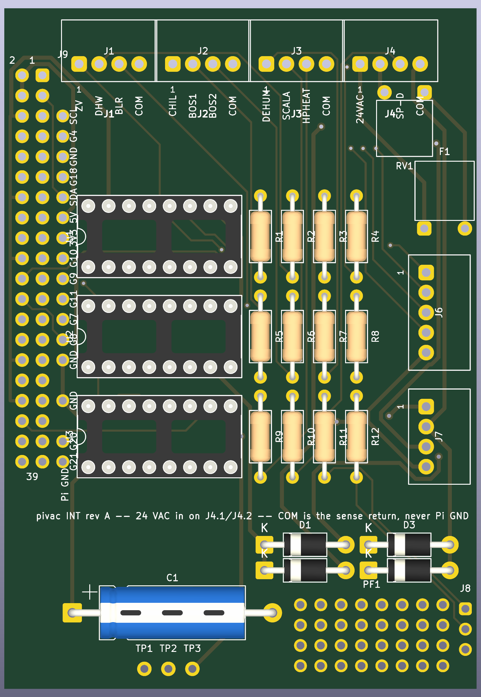
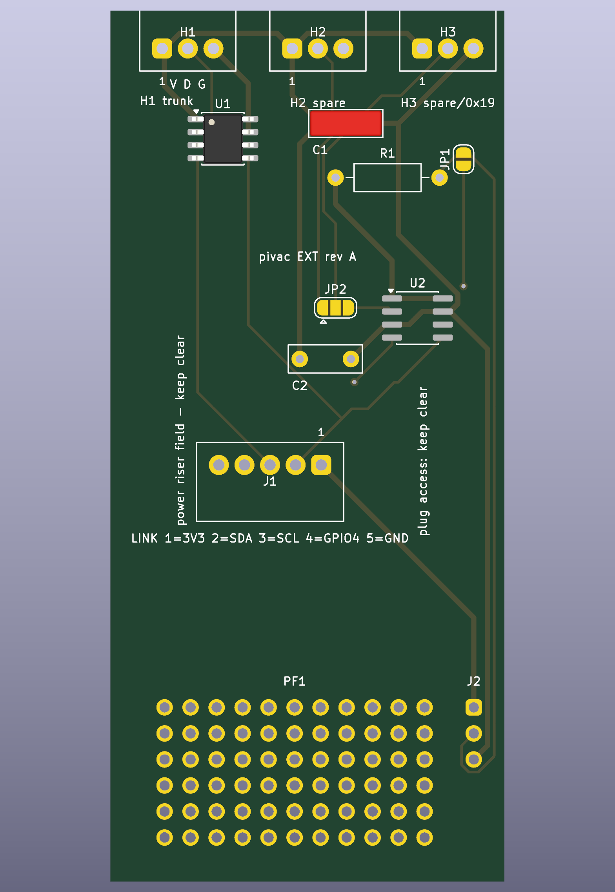

# Raspberry Pi I/O boards, rev A — review before the OSH Park order

The two hand-wired Phoenix perfboards as fabricated PCBs, generated by the scripts in
`hardware/` (`build.sh` runs the chain). Both boards route completely, pass DRC with no
violations and no unconnected items, and their schematics match the boards pin for pin.
Gerbers and drill files are exported and zipped per board. The plan behind the design is
`rpi-io-boards-pcb-plan.md`; this file is the checklist for the order.

| | INT board | EXT board |
|---|---|---|
| Size | 59 × 85 mm, 7.8 in² | 38.5 × 85 mm, 5.1 in² |
| DRC | 0 violations, 0 unconnected | 0 violations, 0 unconnected |
| Schematic | ERC clean, netlist matches the board | ERC clean, netlist matches the board |
| Gerbers | `hardware/int-board/int-board-gerbers.zip` | `hardware/ext-board/ext-board-gerbers.zip` |
| BOM | `hardware/int-board/int-board-bom.csv` | `hardware/ext-board/ext-board-bom.csv` |
| Renders | `hardware/int-board/int-board-{top,bottom}.png` | `hardware/ext-board/ext-board-{top,bottom}.png` |
| Schematic drawing | `hardware/int-board/int-board-schematic.svg` | `hardware/ext-board/ext-board-schematic.svg` |

## INT board: relay inputs, 24 VAC sense supply, Pi header

Eleven sense inputs on J1 to J3 through three LTV-847 optocouplers with 12 kΩ series resistors
(2.8 mA at about 35 V peak); the 24 VAC sense supply on J4.1/J4.2 (PTC, four 1N4007, 100 µF,
MOV position not fitted); the 5-way link to the EXT board J6 and the unfitted 4-way power link
J7, both on the right-hand edge inside the housing's slot with their entries facing the edge;
a shadow column J9 breaking out the free header pins; the reservoir capacitor lying flat along
the bottom-left with three test points below it; the spare channel pads J8 at the right edge
below J7; a prototyping field bottom right. COM is the sense return and is never Pi ground.
Header pins 1, 9, 25 and 39 are left open on the board; the Pi ties each to its twin.

**Height.** The component side faces the cover, whose inner depth is unmeasured but proven
on the built board for a DIP socket with its chip, about 8 mm. Nothing fitted stands taller:
the capacitor is an axial part lying flat (⌀6.5 × 18 mm, 6.9 mm high; the ⌀8 × 18 variant is
8.5 mm and also fits the footprint), the PTC disc lies flat (7.4 mm disc, 3.1 mm thick), the
PTSM headers are 7.5 mm, the resistors and diodes lie flat. The solder side faces the Pi
(`rpi-io-boards-pcb-plan.md` Appendix A.3 maps the Pi's connectors onto the board); nothing
sits there but the socket, and every joint under the Pi's USB stacks is trimmed flush.

**Fitted parts:** C1 100 µF 63 V axial, Vishay 021 ASM ⌀6.5 × 18 (or MAL202138101E3, ⌀8 × 18);
D1–D4 1N4007; F1 PTC 0.1 A 60 V, Littelfuse 60R010XU; J1–J4 PTSM 0,5/4-HH-2,5-THR;
J5 2 × 20 socket on the solder side; J6 PTSM 0,5/5-HH-2,5-THR; R1–R12 12 kΩ 1/4 W; U1–U3 LTV-847
in DIP-16 sockets. **Placed, not fitted:** J7 PTSM 0,5/4-HH-2,5-THR; RV1 MOV 39 V.

## EXT board: DS2482 1-wire master and probe headers

The trunk header H1 (VCC · DATA · GND), two spare headers H2 and H3, the DS2482-100 at 0x18
with its 100 nF, a second DS2482 at 0x19 (U2, not fitted) selectable for H3 by the solder
jumper JP2, the rollback jumper JP1 with its 2.2 kΩ pull-up (not fitted) to run the bus from
GPIO 4 again, the 5-way link J1 (3V3 · SDA · SCL · GPIO4 · GND), a prototyping field, and the
socket and link positions where the built board has them.

**Fitted parts:** C1 100 nF; H1–H3 PTSM 0,5/3-HH-2,5-THR; J1 PTSM 0,5/5-HH-2,5-THR; JP1, JP2
solder jumpers; U1 DS2482-100 SOIC-8. **Placed, not fitted:** C2 100 nF; R1 2.2 kΩ; U2 DS2482-100.

## Checks before ordering

1. **The INT link headers against the housing slot.** The slot on the right-hand side runs
   rows 9–23 (y 29.1–64.7 in the board frame) at the height of a PTSM socket. J6's body spans
   y 30.9–45.1 and J7's 47.65–59.35, both with their pin row 6.3 mm inside the edge and the
   entry face 0.9 mm inside it. Hold a PTSM plug at those spots on the built board with the
   cover on.
2. **Nothing on the component side stands taller than a DIP socket with its chip**, which the
   built board proved against the cover. If the cover's inner depth is ever measured, record
   it in the plan; no part here depends on it being more than 8 mm.
3. **Two model-versus-doc discrepancies**, neither of which affects the fabricated boards,
   which follow the Phoenix models: the EXT model has 33 hole rows where
   `ds18b20-bus-topology.md` counts 32, and the INT model has no holes in column 3 rows 1–21
   where `rpi-io-board-design.md` §4.2 places access pads. Both are a count on the built
   boards, whenever convenient.

## The order

Bare boards from OSH Park, three of each, hand assembled: two-layer, 1.6 mm, 1 oz copper,
HASL. Upload the Gerber zips, or the `.kicad_pcb` files, which OSH Park also accepts.

| | Area | Price for three | Turnaround |
|---|---|---|---|
| INT | 7.8 in² | about $39 at $5/in² | 9–12 days (5 business days at $10/in²) |
| EXT | 5.1 in² | about $26 | same |

Parts from Digi-Key or Mouser per the BOM CSVs: PTSM headers and plugs, the PSTD header,
LTV-847, DS2482-100 and passives. One order covers three boards of each.

After the boards arrive: populate one of each, run the electrical check per
`rpi-io-board-design.md` steps 7–8 and the DS2482 bench check per `ds18b20-bus-topology.md`
§8 on the spare Pi, then swap them into the housing (plan §6 steps 6–8).
