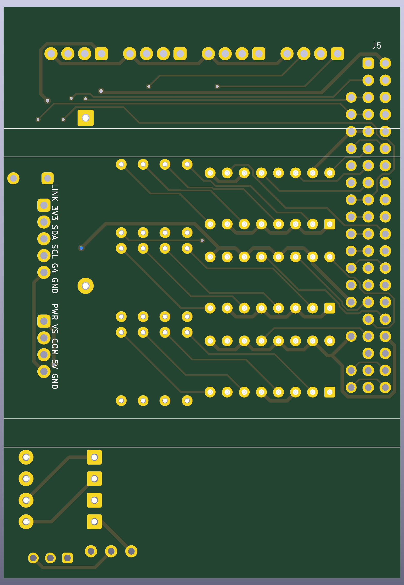
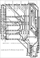
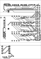
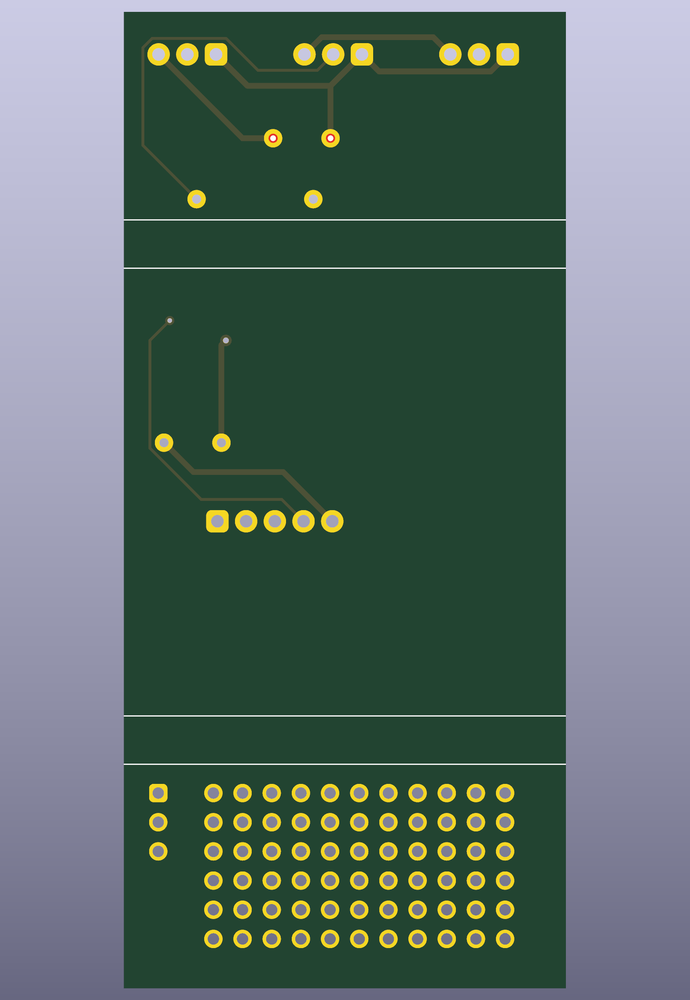
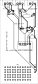
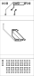

# Raspberry Pi I/O boards, rev A — review before the OSH Park order

The two hand-wired Phoenix perfboards as fabricated PCBs, generated by the scripts in
`hardware/` (`build.sh` runs the chain). Both boards route completely, pass DRC with no
violations and no unconnected items, and their schematics match the boards pin for pin.
Gerbers and drill files are exported and zipped per board. The plan behind the design is
`rpi-io-boards-pcb-plan.md`; this file is the checklist for the order.

| | INT board | EXT board |
|---|---|---|
| Size | 59 × 85 mm, 7.8 in² | 38.5 × 85 mm, 5.1 in² |
| DRC | 0 violations, 0 unconnected | 0 violations, 0 unconnected |
| Schematic | ERC clean, netlist matches the board | ERC clean, netlist matches the board |
| Gerbers | `hardware/int-board/int-board-gerbers.zip` | `hardware/ext-board/ext-board-gerbers.zip` |
| BOM | `hardware/int-board/int-board-bom.csv` | `hardware/ext-board/ext-board-bom.csv` |
| Renders | `hardware/int-board/int-board-{top,bottom}.png` | `hardware/ext-board/ext-board-{top,bottom}.png` |
| Copper plots | `hardware/int-board/int-board-copper-{front,back}.svg` | `hardware/ext-board/ext-board-copper-{front,back}.svg` |
| Schematic drawing | `hardware/int-board/int-board-schematic.svg` | `hardware/ext-board/ext-board-schematic.svg` |

## INT board: relay inputs, 24 VAC sense supply, Pi header

The copper plots are the view to check traces on: front copper with the front silkscreen, and
back copper mirrored, so both read as if looking at that face of the board.

Eleven sense inputs on J1 to J3 through three LTV-847 optocouplers with 12 kΩ series resistors
(2.8 mA at about 35 V peak); the 24 VAC sense supply on J4.1/J4.2 (PTC, four 1N4007, 100 µF); the 5-way link to the EXT board J6 and the unfitted 4-way power link
J7, both on the right-hand edge inside the housing's slot with their entries facing the edge;
a shadow column J9 breaking out the free header pins; the reservoir capacitor standing between
J4 and J6 with the PTC beside it; the bridge diodes in one column at the
bottom right with the test points and the spare channel pads J8 below them. The bottom-left
field is empty on purpose: it lies over the Pi's USB stacks, where a pin tail meets a USB shell.
COM is the sense return and is never Pi ground. Header pins 1, 9, 25 and 39 are left open on
the board; the Pi ties each to its twin.

**Height.** The component side faces the cover, whose inner depth is unmeasured but proven
on the built board for a DIP socket with its chip, about 8 mm. Nothing fitted stands taller:
the capacitor is an axial part lying flat (⌀6.5 × 18 mm, 6.9 mm high; the ⌀8 × 18 variant is
8.5 mm and also fits the footprint), the PTC disc lies flat (7.4 mm disc, 3.1 mm thick), the
PTSM headers are 7.5 mm, the resistors and diodes lie flat. The solder side faces the Pi
(`rpi-io-boards-pcb-plan.md` Appendix A.3 maps the Pi's connectors onto the board); nothing
sits there but the socket, no through-hole part sits under the USB stacks, and the joints under
the Ethernet jack are trimmed flush.

### What each reference is

| Ref | Part | Purpose |
|---|---|---|
| J1–J4 | PTSM 0,5/4 plugs, top edge | Field wiring. J1: ZV, DHW, BLR, COM. J2: CHIL, BOS1, BOS2, COM. J3: DEHUM, SCALA, HPHEAT, COM. J4: 24 VAC, 24 VAC, SP-D, COM. |
| J5 | 2 × 20 socket, solder side | The Pi's GPIO header. |
| J6 | PTSM 0,5/5, right edge | Link to the EXT board: 3V3, SDA, SCL, GPIO4, GND. |
| J7 | PTSM 0,5/4, right edge, not fitted | Power link for a later bus-powered Pi: VS, COM, +5V, GND. |
| J8 | three pads, bottom right | Spare channels SP-C and SP-E with COM, for wires. |
| J9 | shadow column beside the header | One labelled pad per free header pin (SCL, GPIO4, GND, GPIO18, SDA, 5V, 3V3, GPIO10, 9, 11, 7, 8, GND, GND, GPIO20, GPIO21). |
| U1–U3 | LTV-847 in DIP-16 sockets | Four optocoupler channels each: U1 for J1's three and CHIL, U2 for BOS1, BOS2, DEHUM, SCALA, U3 for HPHEAT, SP-D, SP-C, SP-E. |
| R1–R12 | 12 kΩ 1/4 W | LED series resistor for each channel, 2.8 mA from the 35 V rail; R1–R4 beside U1, R5–R8 beside U2, R9–R12 beside U3. |
| D1–D4 | 1N4007 | Full-wave bridge from the 24 VAC on J4.1/J4.2 to the VS rail and COM. |
| C1 | 100 µF 63 V axial, flat | Reservoir on the VS rail; holds the ripple to 2.8 V. |
| F1 | PTC 0.1 A 60 V, flat | Resettable fuse in the 24 VAC feed. |
| TP1–TP3 | test pads | VS, COM and Pi GND for a meter. |

**Fitted parts:** C1 100 µF 63 V axial, Vishay 021 ASM ⌀6.5 × 18 (or MAL202138101E3, ⌀8 × 18);
D1–D4 1N4007; F1 PTC 0.1 A 60 V, Littelfuse 60R010XU; J1–J4 PTSM 0,5/4-HH-2,5-THR;
J5 2 × 20 socket on the solder side; J6 PTSM 0,5/5-HH-2,5-THR; R1–R12 12 kΩ 1/4 W; U1–U3 LTV-847
in DIP-16 sockets. **Placed, not fitted:** J7 PTSM 0,5/4-HH-2,5-THR.

## EXT board: DS2482 1-wire master and probe headers

The trunk header H1 (VCC · DATA · GND), two spare headers H2 and H3, the DS2482-100 at 0x18
with its 100 nF, a second DS2482 at 0x19 (U2, not fitted) selectable for H3 by the solder
jumper JP2, the rollback jumper JP1 with its 2.2 kΩ pull-up (not fitted) to run the bus from
GPIO 4 again, the 5-way link J1 (3V3 · SDA · SCL · GPIO4 · GND) at the built board's row but
moved against the riser field so the right of the board stays clear where the housing opens to
the INT board and the PTSM plugs pass through, a prototyping field, and the probe sockets where
the built board has them.

### What each reference is

| Ref | Part | Purpose |
|---|---|---|
| H1 | PTSM 0,5/3, top edge | The 1-wire trunk: VCC, DATA, GND. |
| H2 | PTSM 0,5/3, top edge | Spare probe header on the same bus. |
| H3 | PTSM 0,5/3, top edge | Spare probe header, on the bus or on U2 by JP2. |
| J1 | PTSM 0,5/5 | Link from the INT board: 3V3, SDA, SCL, GPIO4, GND. |
| J2 | three pads | VCC, DATA, GND of the bus, for wires or a scope. |
| U1 | DS2482-100 at 0x18 | The I²C 1-wire master that drives the bus. |
| U2 | DS2482-100 at 0x19, not fitted | A second master for a second bus on H3. |
| C1, C2 | 100 nF | Supply decoupling for U1 and U2 (C2 not fitted). |
| JP1 | solder jumper | Joins GPIO4 to DATA to run the bus from the Pi's own 1-wire again. |
| JP2 | three-way solder jumper | Puts H3 on the bus or on U2. |
| R1 | 2.2 kΩ, not fitted | DATA pull-up for the GPIO4 rollback; the DS2482 supplies its own. |

**Fitted parts:** C1 100 nF; H1–H3 PTSM 0,5/3-HH-2,5-THR; J1 PTSM 0,5/5-HH-2,5-THR; JP1, JP2
solder jumpers; U1 DS2482-100 SOIC-8. **Placed, not fitted:** C2 100 nF; R1 2.2 kΩ; U2 DS2482-100.

## Checks before ordering

Both checks are done; the boards can be ordered.

1. **The INT link headers against the housing slot: done.** The slot on the right-hand side
   runs y 26–59 from the board's top edge, measured on the housing, and two 4-way headers with
   their pins in the third hole column from the edge and a row between fit it on the built
   board (2026-09-12). J6's body spans y 27.4–41.6 and J7's 44.65–56.35, pin row 6.0 mm inside
   the edge, entry face 0.6 mm inside it.
2. **Nothing on the component side stands taller than a DIP socket with its chip**, which the
   built board proved against the cover. If the cover's inner depth is ever measured, record
   it in the plan; no part here depends on it being more than 8 mm.
3. **Two model-versus-doc discrepancies**, neither of which affects the fabricated boards,
   which follow the Phoenix models: the EXT model has 33 hole rows where
   `ds18b20-bus-topology.md` counts 32, and the INT model has no holes in column 3 rows 1–21
   where `rpi-io-board-design.md` §4.2 places access pads. Both are a count on the built
   boards, whenever convenient.

## The order

Bare boards from OSH Park, three of each, hand assembled: two-layer, 1.6 mm, 1 oz copper,
HASL. Upload the Gerber zips, or the `.kicad_pcb` files, which OSH Park also accepts.

| | Area | Price for three | Turnaround |
|---|---|---|---|
| INT | 7.8 in² | about $39 at $5/in² | 9–12 days (5 business days at $10/in²) |
| EXT | 5.1 in² | about $26 | same |

Parts from Digi-Key or Mouser per `rpi-io-boards-parts.md`, which lists every reference with
the maker's part number, a description to search on, quantities for one and for three boards,
and distributor links. One order covers three boards of each.

**Ordering the boards.** OSH Park's importer runs KiCad 9, and these are KiCad 10 files, so
upload the Gerber zips, not the `.kicad_pcb` files: at oshpark.com, sign in, upload
`int-board-gerbers.zip`, check the layer previews it renders (top and bottom copper, mask and
silkscreen, drills, a 59 × 85 mm outline), keep the 2-layer service and the minimum quantity of
three, add to cart, then repeat with `ext-board-gerbers.zip` (38.5 × 85 mm). Checkout; shipping
in the US is free and the boards arrive in about 9–12 days, or 5 business days at twice the
price with the Super Swift option.

After the boards arrive: populate one of each, run the electrical check per
`rpi-io-board-design.md` steps 7–8 and the DS2482 bench check per `ds18b20-bus-topology.md`
§8 on the spare Pi, then swap them into the housing (plan §6 steps 6–8).
